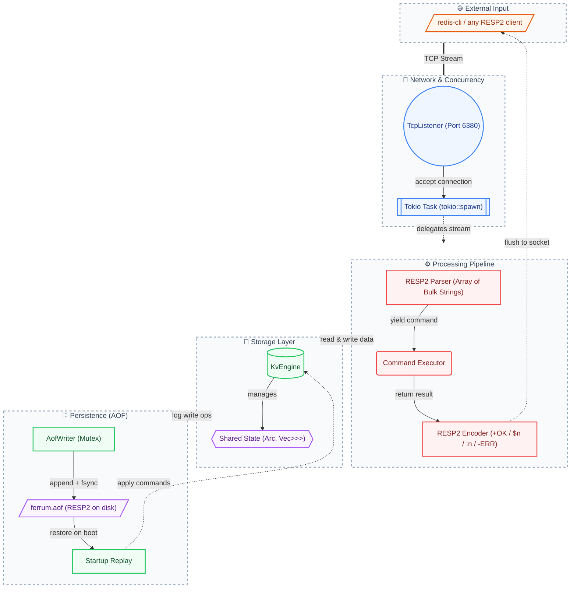

# FerrumKV 🦀

[](https://github.com/phaethix/ferrum-kv/actions/workflows/ci.yml)
[](https://crates.io/crates/ferrum-kv)
[](./LICENSE)
[](./CONTRIBUTING.md)

**The eviction algorithm laboratory for RESP2-compatible KV stores — and the most readable systems-programming codebase in Rust.**

FerrumKV is not the fastest RESP2 server (that's [kevy](https://github.com/goliajp/kevy)). It's not the most command-complete (that's Redis). It's the one you can **understand in an afternoon**, **experiment with 10 cache eviction policies**, and **contribute to without a PhD in database internals**.

---

## Why FerrumKV?

<table>
<tr>
<td width="33%">

### 🧪 Eviction Algorithm Lab

The only KV that ships **10 eviction policies** as first-class features — LRU, LFU, random, TTL, and our own **AHE** (Adaptive Hybrid Eviction) that blends recency, frequency, and TTL into a self-tuning score. Swap policies at runtime. Benchmark them against each other. Add your own.

</td>
<td width="33%">

### 📖 Readable by Design

~8,500 lines of clean, layered, well-commented Rust. No hand-bound syscalls. No custom slab allocators. No macro magic. Every module has a doc comment explaining *why*, not just *what*. If you're learning systems programming, this is the codebase you want to read.

</td>
<td width="33%">

### 🔌 Embeddable Library

Zero heavy dependencies. Use it as a binary (`ferrum-kv`) or as a library (`ferrum-kv = "0.5"`). Embed a RESP2-compatible cache directly into your Rust application — no external process, no port to secure, no Redis to manage.

</td>
</tr>
</table>

---

## Eviction Algorithm Showcase

This is where FerrumKV is unique. Pick your policy based on your workload:

| Policy | Type | Recency | Frequency | TTL-Aware | Self-Tuning | Best For |
|--------|------|---------|-----------|-----------|-------------|----------|
| `noeviction` | — | — | — | — | — | Write-through caches, bounded datasets |
| `allkeys-lru` | LRU | ✅ | — | — | — | Temporal locality (most web workloads) |
| `volatile-lru` | LRU | ✅ | — | ✅ | — | Mixed TTL + recency patterns |
| `allkeys-lfu` | LFU | — | ✅ | — | — | Stable popularity distributions |
| `volatile-lfu` | LFU | — | ✅ | ✅ | — | TTL keys with frequency bias |
| `allkeys-random` | Random | — | — | — | — | Uniform access (rare, but cheap) |
| `volatile-random` | Random | — | — | ✅ | — | Quick-and-dirty TTL eviction |
| `volatile-ttl` | TTL | — | — | ✅ | — | Shortest TTL first (session stores) |
| **`allkeys-ahe`** ✨ | **Adaptive** | ✅ | ✅ | ✅ | ✅ | **Mixed workloads, unknown patterns** |
| **`volatile-ahe`** ✨ | **Adaptive** | ✅ | ✅ | ✅ | ✅ | **TTL keys with shifting popularity** |

> **AHE (Adaptive Hybrid Eviction)** is FerrumKV's original contribution. It computes an *Eviction Priority Score* (EPS) for each candidate key, blending three signals:
> - **Recency** — how recently was this key accessed?
> - **Frequency** — how often is this key accessed? (Morris probabilistic counter)
> - **TTL urgency** — how close is this key to expiring naturally?
>
> The weight between recency and frequency (`α`) adapts automatically based on the observed hit ratio. Read the [AHE whitepaper](./docs/whitepaper.md) for the full design.

```bash
# Try different policies on the same workload:
ferrum-kv --maxmemory 256mb --maxmemory-policy allkeys-lru
ferrum-kv --maxmemory 256mb --maxmemory-policy allkeys-ahe
ferrum-kv --maxmemory 256mb --maxmemory-policy volatile-ttl
```

---

## Code Tour (30 seconds)

The entire server request path, from TCP byte to TCP response, fits in your head:

```rust
// src/network/server.rs — the hot path, simplified
async fn handle_client(stream: TcpStream, engine: KvEngine) {
    let mut buf = Vec::new();
    loop {
        // 1. Read bytes from the wire
        let n = stream.read_buf(&mut buf).await?;

        // 2. Parse one complete RESP2 frame
        let (cmd, consumed) = parser::parse_frame(&buf)?;
        buf.drain(..consumed);

        // 3. Execute the command against the engine
        let result = execute_command(&engine, cmd);

        // 4. Encode the result as RESP2 and flush
        let resp = encoder::encode(&result);
        stream.write_all(&resp).await?;
    }
}
```

Every module follows this pattern — one concern, one file, clear boundaries:

```
src/
├── main.rs              # entry point, signal handlers
├── cli.rs               # argument parsing + config merging
├── protocol/
│   ├── parser.rs        # incremental RESP2 frame parser
│   └── encoder.rs       # RESP2 response encoder
├── network/
│   ├── server.rs        # accept loop, handle_client, command dispatch
│   └── shutdown.rs      # graceful shutdown (SIGINT/SIGTERM)
├── storage/
│   ├── engine/          # KvEngine — the core hash map + command API
│   ├── eviction.rs      # 10 eviction policies + AHE algorithm
│   └── expire.rs        # background TTL sweeper
├── persistence/
│   ├── writer.rs        # AOF append + fsync policies
│   └── replay.rs        # AOF replay on startup
├── config/              # Redis-style config file parser
└── error/               # unified FerrumError (9 variants)
```

**You can read this codebase end-to-end in an afternoon.** That's the point.

---

## Quick Start

```bash
# Build and run (in-memory, no persistence)
cargo build --release
./target/release/ferrum-kv

# With AOF persistence + eviction
./target/release/ferrum-kv \
  --aof-path /tmp/ferrum.aof \
  --maxmemory 256mb \
  --maxmemory-policy allkeys-ahe

# Talk to it with any Redis client
redis-cli -p 6380
```

```
redis-cli -p 6380> SET user:1000 '{"name":"Alice"}'
OK
redis-cli -p 6380> GET user:1000
{"name":"Alice"}
redis-cli -p 6380> EXPIRE user:1000 3600
(integer) 1
redis-cli -p 6380> INFO memory
# Memory
used_memory:184
maxmemory:268435456
ahe_alpha:0.62
...
```

### CLI Flags (essentials)

| Flag | Default | Description |
|------|---------|-------------|
| `--addr HOST:PORT` | `127.0.0.1:6380` | Listening address |
| `--aof-path PATH` | *(disabled)* | Enable AOF persistence |
| `--appendfsync POLICY` | `everysec` | `always` / `everysec` / `no` |
| `--maxmemory BYTES` | `0` (unlimited) | Memory cap with optional suffix: `512b`, `64kb`, `256mb`, `1gb` |
| `--maxmemory-policy POLICY` | `noeviction` | Any of the 10 policies above |
| `--maxmemory-samples N` | `5` | Candidates inspected per eviction |
| `--io-threads N` | `0` (auto) | Tokio worker thread count |

For all flags: `ferrum-kv --help`. Redis-style config file: see [`ferrum.conf.example`](./ferrum.conf.example).

---

## Benchmarks

Apple M5 (10 cores), 32GB RAM, loopback, `redis-benchmark -n 100000 -c 50`:

| Scenario | SET QPS | GET QPS | p50 Latency |
|----------|---------|---------|-------------|
| Baseline (no eviction) | 62,189 | 65,231 | 0.42ms |
| Pipelined (`-P 16`) | 350,877 | 378,787 | 1.06ms |
| LFU eviction (16MB cap) | 57,339 | 61,690 | 0.42ms |
| AHE eviction (16MB cap) | 59,559 | 50,787 | 0.42ms |
| 500 concurrent clients | 50,301 | 43,440 | 5.87ms |

Full benchmark report: [`benches/redis-benchmark.md`](./benches/redis-benchmark.md).

---

## Architecture



---

## Contributing

FerrumKV is built for contributors. The codebase is small enough to understand in a day, the test suite tells you immediately if you broke something, and there's a structured path from "first PR" to "core contributor."

### Good First Issues

| Issue | Area | Difficulty | Skills |
|-------|------|------------|--------|
| [FERRUM-006](./.issues/006-config-set-get-runtime-config.md) — CONFIG SET/GET | Config + Protocol | **Beginner** | Rust enums, string parsing |
| [FERRUM-007](./.issues/007-auth-requirepass.md) — AUTH command | Network | **Beginner** | Connection state, config |
| [FERRUM-009](./.issues/009-implement-sieve-eviction.md) — SIEVE eviction | Storage | **Intermediate** | Algorithm implementation |
| [FERRUM-011](./.issues/011-eviction-benchmark-suite.md) — Benchmark suite | Storage + Scripting | **Intermediate** | Workload generation, statistics |

### Development Flow

```bash
git clone https://github.com/phaethix/ferrum-kv.git
cd ferrum-kv

# Make your change, then run the CI gate locally:
cargo fmt --check
cargo clippy --all-targets -- -D warnings
cargo test --all-targets --all-features

# 293 tests. Zero warnings. If it's green, it's ready for review.
```

Read [`CONTRIBUTING.md`](./CONTRIBUTING.md) for the full workflow, commit conventions, and review process.

### Project Values

- **Binary safety is sacred.** Keys and values are `Vec<u8>`, never assume UTF-8.
- **No unwrap() on runtime data.** Every fallible path returns `Result<_, FerrumError>`.
- **Tests guard invariants, not just coverage.** 293 tests exist to prevent regressions, not to hit a metric.
- **Design decisions are documented.** See `.atomcode.md` for hard rules, `docs/whitepaper.md` for architecture rationale.

---

## Supported Commands

All commands speak **RESP2** — any Redis client works out of the box. Command names are case-insensitive.

| Command | Description | Response |
|---------|-------------|----------|
| `SET key value` | Store a key-value pair | `+OK` |
| `SETNX key value` | Store only if key doesn't exist | `:1` / `:0` |
| `GET key` | Retrieve value by key | Bulk string or nil |
| `MSET k v [k v ...]` | Atomically set multiple pairs | `+OK` |
| `MGET key [key ...]` | Retrieve multiple values | Array of bulk/nil |
| `APPEND key value` | Append bytes to key's value | `:N` (new length) |
| `STRLEN key` | Byte length of value | `:N` |
| `INCR` / `DECR` | Increment/decrement by 1 | `:N` (new value) |
| `INCRBY` / `DECRBY` | Increment/decrement by delta | `:N` (new value) |
| `DEL key [key ...]` | Delete one or more keys | `:N` (deleted count) |
| `EXISTS key [key ...]` | Count existing keys | `:N` |
| `PING [message]` | Health check | `+PONG` or echo |
| `DBSIZE` | Number of keys | `:N` |
| `FLUSHDB` | Remove all keys | `+OK` |
| `EXPIRE` / `PEXPIRE` | Set TTL in seconds/ms | `:1` / `:0` |
| `PEXPIREAT key ms-ts` | Set absolute TTL (ms epoch) | `:1` / `:0` |
| `PERSIST key` | Remove TTL | `:1` / `:0` |
| `TTL` / `PTTL key` | Remaining TTL in seconds/ms | `:N` / `-1` / `-2` |
| `MEMORY USAGE key` | Estimated memory for a key | `:N` or nil |
| `INFO [section]` | Server metrics | Bulk string |

---

## What's Next

FerrumKV is on a mission to be the best platform for learning and experimenting with KV store internals. Here's what's coming:

| Version | Focus | Highlights |
|---------|-------|------------|
| **v0.5.0** | Operational readiness | CONFIG SET/GET, AUTH, SLOWLOG, AOF REWRITE, MONITOR |
| **v0.5.1** | Eviction platform | SIEVE (NSDI'24), SIEVE-S (TTL-aware SIEVE), AdaptiveClimb, EvictionPolicy trait, benchmark suite |
| **v0.6.0** | RESP3 protocol | `HELLO 3` handshake, typed replies, client-side caching, backward-compatible with RESP2 |
| **v0.7.0** | Data types | List (LPUSH/RPOP/LRANGE), Hash (HSET/HGET/HGETALL), Set (SADD/SMEMBERS/SINTER) |

See [`docs/product-strategy.md`](./docs/product-strategy.md) for the full roadmap and rationale.

---

## License

MIT — see [`LICENSE`](./LICENSE).

---

<p align="center">
  <b>Built for learning. Designed for experimentation. Open for contribution.</b><br>
  <sub>If you've ever wanted to understand how Redis works under the hood, start here.</sub>
</p>
