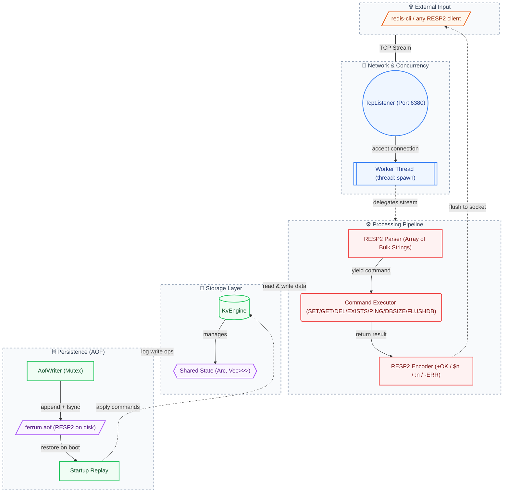

# FerrumKV 🦀

A lightweight, multi-threaded KV storage server written in Rust — built from scratch for systems programming practice.

## Architecture



## Quick Start

```bash
# Build
cargo build --release

# Run without persistence (in-memory only)
cargo run --release

# Run with AOF persistence (survives restarts)
cargo run --release -- --aof-path /tmp/ferrum.aof

# Run with explicit fsync policy: always | everysec (default) | no
cargo run --release -- --aof-path /tmp/ferrum.aof --appendfsync always

# Connect with the official Redis CLI
redis-cli -p 6380
```

### CLI Flags

| Flag | Default | Description |
|---|---|---|
| `--addr HOST:PORT` | `127.0.0.1:6380` | Listening address |
| `--aof-path PATH` | *(disabled)* | Enables AOF persistence at the given path |
| `--appendfsync POLICY` | `everysec` | Fsync policy when AOF is enabled (`always` / `everysec` / `no`) |

## Supported Commands

All commands are spoken over **RESP2** (the same wire protocol as Redis), so any Redis client works out of the box.

| Command              | Description                              | RESP2 Response                        |
|----------------------|------------------------------------------|----------------------------------------|
| `SET key value`      | Store a key-value pair                   | `+OK`                                  |
| `GET key`            | Retrieve value by key                    | Bulk string, or nil (`$-1`)            |
| `DEL key [key ...]`  | Delete one or more keys                  | `:N` — number of keys actually deleted |
| `EXISTS key [key ...]` | Count how many of the given keys exist  | `:N`                                   |
| `PING [message]`     | Health check (echoes `message` if given) | `+PONG` or bulk string                 |
| `DBSIZE`             | Return number of keys                    | `:N`                                   |
| `FLUSHDB`            | Remove all keys                          | `+OK`                                  |

Command names are **case-insensitive**.

### Binary Safety

Keys and values are stored as raw `Vec<u8>`, so arbitrary bytes — including `NUL`, `\r\n`, and non‑UTF‑8 sequences — round-trip unchanged through both the network layer and the AOF file.

## Error Handling

All operations return structured RESP2 errors (`-ERR ...`) instead of panicking:

- Parse errors: `-ERR wrong number of arguments for 'SET' command`
- Unknown commands: `-ERR unknown command 'FOOBAR'`
- Internal errors: `-ERR internal error: lock poisoned`

## Persistence (AOF)

When `--aof-path` is set, every write command (`SET` / `DEL` / `FLUSHDB`) is appended to the AOF file **in RESP2 format** — the exact same bytes a client would send over the wire. On startup, FerrumKV replays the file to rebuild state; a half-written tail record is safely truncated.

Fsync policies follow Redis semantics:

- `always` — fsync after every write (safest, slowest)
- `everysec` — fsync once per second on a background tick (default)
- `no` — let the OS decide (fastest, least durable)

## Roadmap

- [x] Core KV engine (`SET` / `GET` / `DEL` / `EXISTS` / `PING` / `DBSIZE` / `FLUSHDB`)
- [x] Unified error handling with `Result` propagation
- [x] RESP2 protocol (binary-safe, compatible with `redis-cli`)
- [x] AOF persistence with configurable fsync + replay on startup
- [ ] Graceful shutdown (SIGINT / SIGTERM) + structured logging
- [ ] TTL (key expiration) & memory eviction (LRU / LFU / AHE)
- [ ] Async I/O (Tokio)

## License

MIT
