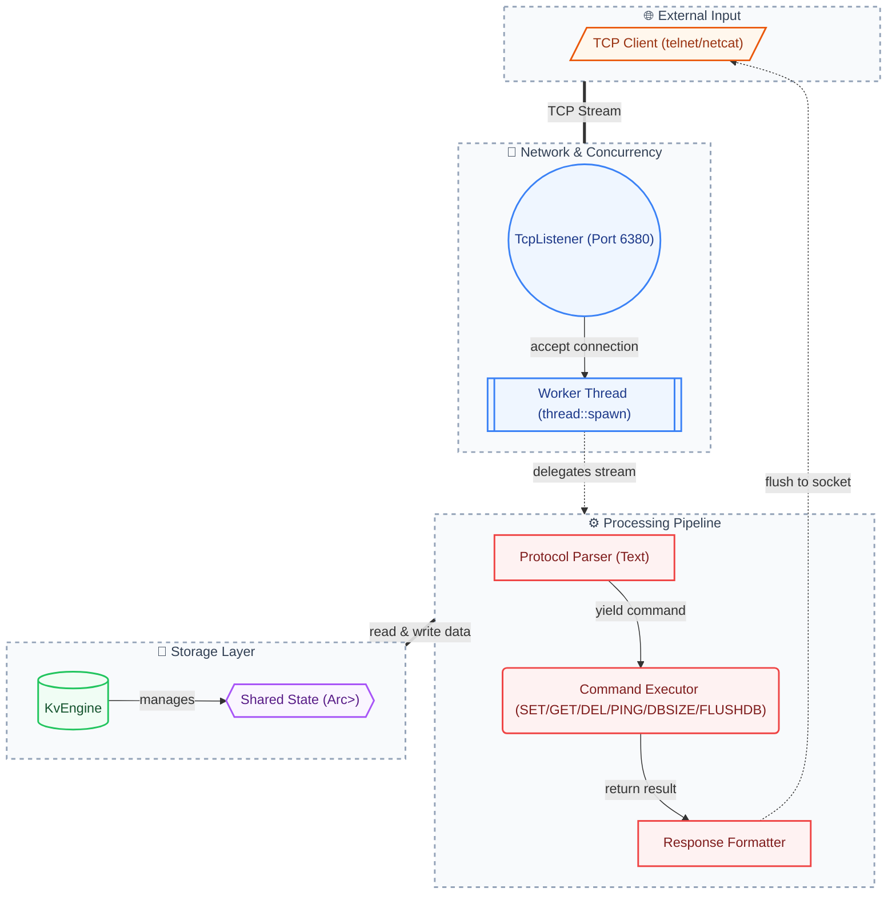

# FerrumKV 🦀

A lightweight, multi-threaded KV storage server written in Rust — built from scratch for systems programming practice.

## Architecture



## Quick Start

```bash
# Build
cargo build

# Run server (listens on 127.0.0.1:6380)
cargo run

# Connect with telnet or netcat
telnet 127.0.0.1 6380
```

## Supported Commands

| Command           | Description                  | Response          |
|--------------------|------------------------------|-------------------|
| `SET key value`   | Store a key-value pair       | `OK`              |
| `GET key`         | Retrieve value by key        | value or `NULL`   |
| `DEL key`         | Delete a key                 | `OK` or `NULL`    |
| `PING`            | Health check                 | `PONG`            |
| `DBSIZE`          | Return number of keys        | count             |
| `FLUSHDB`         | Remove all keys              | `OK`              |

Commands are **case-insensitive**. Values can contain spaces (e.g. `SET msg hello world`).

## Error Handling

All operations return structured error responses instead of panicking:

- Parse errors: `ERR wrong number of arguments for 'SET' command`
- Unknown commands: `ERR unknown command: FOOBAR`
- Internal errors: `ERR internal error: lock poisoned`

## Roadmap

- [x] Core KV engine (SET/GET/DEL/PING/DBSIZE/FLUSHDB)
- [x] Unified error handling with Result propagation
- [ ] AOF persistence
- [ ] TTL (key expiration)
- [ ] RESP protocol support
- [ ] Async I/O (tokio)

## License

MIT
