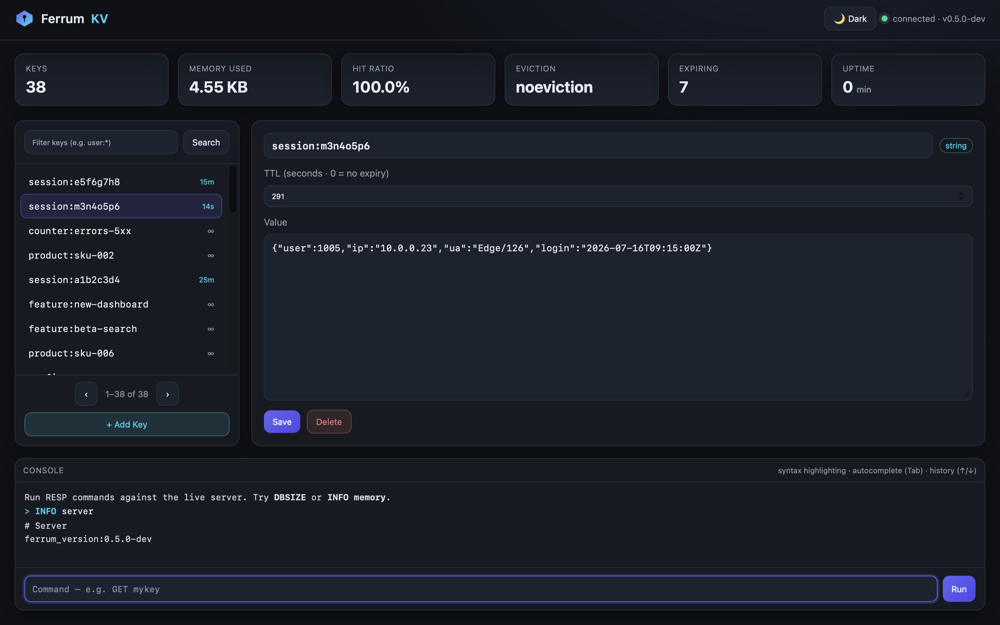
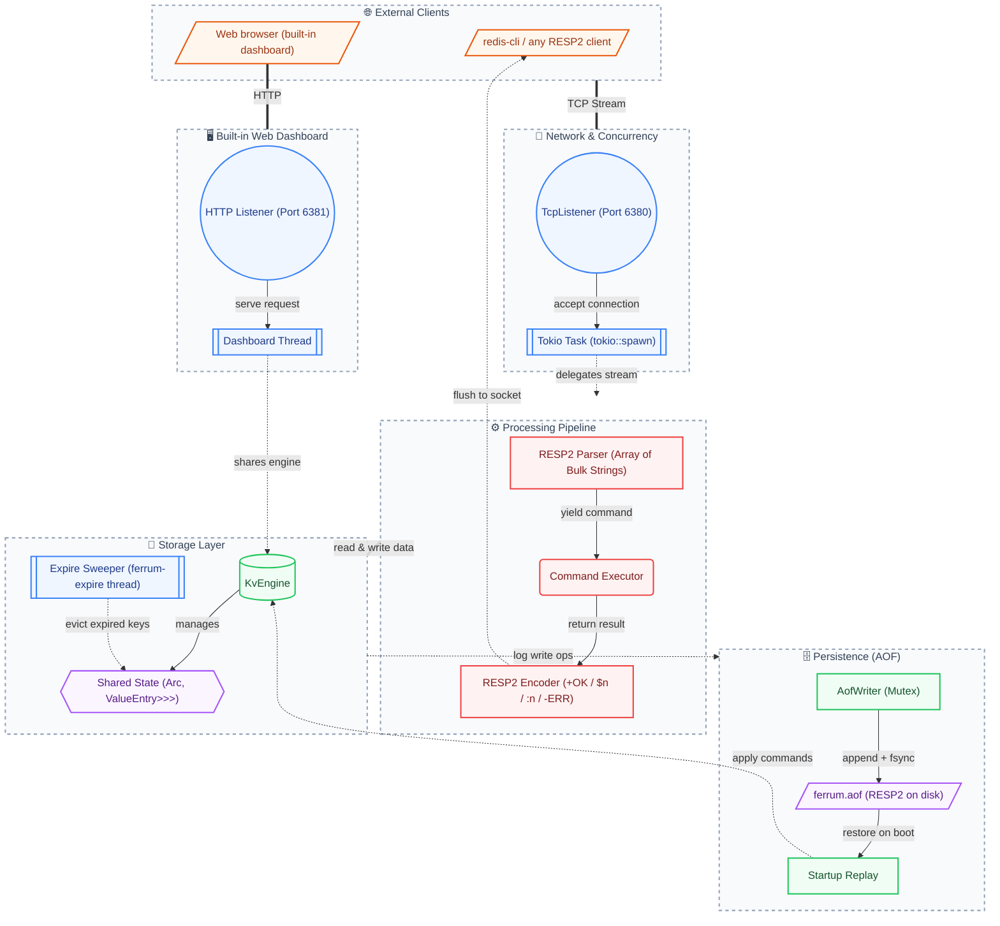

<p align="center">
  
</p>

<h1 align="center">FerrumKV</h1>

<p align="center">
  <b>Eviction algorithm laboratory for RESP2-compatible KV stores.</b><br>
  <sub>16 cache eviction policies, built-in web dashboard, written in Rust.</sub>
</p>

<p align="center">
  <a href="https://github.com/phaethix/ferrum-kv/releases"></a>
  <a href="./LICENSE"></a>
  <a href="https://github.com/phaethix/ferrum-kv/actions/workflows/ci.yml"></a>
  
  
</p>

---

## Table of Contents

- [Features](#features)
- [Why FerrumKV](#why-ferrumkv)
- [Quick Start](#quick-start)
- [Dashboard](#dashboard)
- [Eviction Policies](#eviction-policies)
- [Architecture](#architecture)
- [Benchmarks](#benchmarks)
- [CLI Flags](#cli-flags)
- [Contributing](#contributing)
- [Roadmap](#roadmap)

---

## Features

- **Original AHE Algorithm** — FerrumKV's own *Adaptive Hybrid Eviction* blends recency, frequency, and TTL into one score and tunes its own weights from live hit-ratio feedback. No tuning required. [Read the paper →](docs/reference/ahe.md)
- **16 Eviction Policies** — LRU, LFU, Random, TTL, SIEVE (NSDI'24), AdaptiveClimb (arXiv:2511.21235), and AHE. Swap at runtime, exactly like Redis' `maxmemory-policy`.
- **Built-in Web Dashboard** — Key browser, inline editor, live stats, command console. Zero config, no extra dependencies.
- **RESP2 Compatible** — Works with any Redis client (`redis-cli`, Redis Insight, etc.).
- **Readable Codebase** — ~8,500 lines of layered, well-commented Rust. No macro magic, no custom allocators — built to be read.

## Why FerrumKV

There are many mature KV stores. FerrumKV does **not** try to replace Redis in production — it is built to be **read, learned from, and experimented with**. Three things set it apart:

- **A self-tuning eviction algorithm.** `AHE` (Adaptive Hybrid Eviction) fuses recency, frequency, and TTL into a single *Eviction Priority Score* and self-tunes its weights from live hit-ratio feedback — an experimental design you can read, benchmark, and compare against LRU/LFU/SIEVE rather than a drop-in clone of an existing policy. [Paper →](docs/reference/ahe.md)
- **Readable end-to-end.** ~8,500 lines of layered Rust with no macro magic and no custom allocators. From TCP → RESP2 parsing → engine → eviction → AOF → Tokio async, the whole pipeline is followable in an afternoon.
- **Self-contained and Redis-flavoured.** A single static binary, RESP2-compatible, driven by `redis-cli`/`redis-benchmark`, with a zero-dependency web dashboard and 16 eviction policies (10 Redis-style + AHE, SIEVE-S, and AdaptiveClimb originals) you can swap at runtime.

In short: the shortest path from *"I use Redis"* to *"I understand how a Redis-like KV store actually works."*

## Quick Start

```bash
cargo build --release

# In-memory (default: :6380, dashboard on :6381)
./target/release/ferrum-kv

# With AOF persistence + AHE eviction
./target/release/ferrum-kv \
  --aof-path /tmp/ferrum.aof \
  --maxmemory 256mb \
  --maxmemory-policy allkeys-ahe
```

```text
$ redis-cli -p 6380
redis-cli> SET user:1000 '{"name":"Alice"}'
OK
redis-cli> GET user:1000
{"name":"Alice"}
redis-cli> INFO memory
# Memory
used_memory:184
maxmemory:268435456
...
```

Open **http://127.0.0.1:6381** for the built-in dashboard.

## Dashboard



| Feature | Description |
|---------|-------------|
| Key browser | Glob search (`user:*`, `session?`), paginated list, TTL badges |
| Inline editor | View, edit, set TTL, delete keys in-browser |
| Live stats | Keys, memory, hit ratio, eviction policy — auto-refresh every 2s |
| Command console | Run any RESP command (`GET`, `SET`, `INFO`, …) with syntax highlighting & autocomplete |

## Eviction Policies

| Policy | Type | Recency | Frequency | TTL-Aware | Self-Tuning |
|--------|------|:-------:|:---------:|:---------:|:-----------:|
| `noeviction` | — | | | | |
| `allkeys-lru` / `volatile-lru` | LRU | x | | x | |
| `allkeys-lfu` / `volatile-lfu` | LFU | | x | x | |
| `allkeys-random` / `volatile-random` | Random | | | x | |
| `volatile-ttl` | TTL | | | x | |
| `allkeys-sieve` / `volatile-sieve` | SIEVE (NSDI'24) | x | | | |
| **`allkeys-sieves`** / **`volatile-sieves`** | SIEVE-S (FerrumKV) | x | | x | |
| **`allkeys-adaptiveclimb`** / **`volatile-adaptiveclimb`** | AdaptiveClimb (arXiv:2511.21235) | x | x | | x |
| **`allkeys-ahe`** / **`volatile-ahe`** | Adaptive | x | x | x | x |

[AHE](./docs/reference/ahe.md) (Adaptive Hybrid Eviction) blends recency, frequency, and TTL urgency into a self-tuning *Eviction Priority Score*.

## Architecture



## Benchmarks

Apple M5 (10 cores), loopback, `redis-benchmark -n 100000 -c 50`:

| Scenario | SET QPS | GET QPS | p50 Latency |
|----------|--------:|--------:|------------:|
| Baseline (no eviction) | 62,189 | 65,231 | 0.42ms |
| Pipelined `-P 16` | 350,877 | 378,787 | 1.06ms |
| LFU (16MB cap) | 57,339 | 61,690 | 0.42ms |
| AHE (16MB cap) | 59,559 | 50,787 | 0.42ms |

Full report: [`benches/redis-benchmark.md`](benches/redis-benchmark.md)

### Hit ratio — the metric an eviction algorithm is judged on

Throughput (above) says how fast the engine serves requests; it says nothing
about what an eviction algorithm is *for* — keeping the working set cached. The
table below is the comparison the QPS numbers cannot show: under realistic
access patterns, how much of the working set stays cached. Measured end-to-end
against a live, memory-capped server (working set **100,000 keys**, cache capped
at **5,000 entries ≈ 590 KiB** — so eviction is under constant pressure):

| Policy | `zipf` (stable skew) | `shift` (rotating hot set) | `mixed` (OLTP-like) | `scan` (sequential) |
|--------|---------------------:|---------------------------:|---------------------:|--------------------:|
| `allkeys-lru` | 59.5% | 52.4% | 56.3% | 0.0% |
| `allkeys-lfu` | 59.4% | 51.1% | 58.0% | 0.0% |
| `allkeys-ahe` | 59.5% | 52.3% | 56.8% | 0.0% |
| `allkeys-random` | 57.1% | 52.4% | 54.5% | 0.0% |

**AHE is the no-regret choice.** On every pattern it tracks the better of LRU
and LFU and never hits either policy's worst case: LFU's sticky frequency
counters collapse to **51.1%** on a shifting hot set while AHE holds at **52.3%**,
and under a scan-heavy mix AHE (**56.8%**) stays clear of LRU's dip to **56.3%**
and `random`'s **54.5%** floor. That adaptivity — not a fixed bias toward
recency or frequency — is the point of the algorithm.

Method and a TTL-intensive pattern live in
[`docs/reference/benchmarks.md`](docs/reference/benchmarks.md); the harness is
[`examples/hit_ratio_bench.rs`](examples/hit_ratio_bench.rs) (reproduce with
`scripts/bench-hit-ratio.sh`). Figures vary ~±1 pp across runs because the
engine's internal LFU/LRU sampling RNG is seeded from the wall clock.

## CLI Flags

| Flag | Default | Description |
|------|---------|-------------|
| `--config PATH` | *(none)* | Load a config file (directives below) |
| `--addr HOST:PORT` | `127.0.0.1:6380` | RESP listening address |
| `--dashboard-addr ADDR\|off` | `127.0.0.1:6381` | Web dashboard address, or `off` to disable |
| `--aof-path PATH` | *(disabled)* | Enable AOF persistence |
| `--appendfsync POLICY` | `everysec` | `always` / `everysec` / `no` |
| `--client-timeout SECONDS` | `0` (disabled) | Per-connection idle timeout |
| `--maxclients N` | *(unlimited)* | Max concurrent client connections |
| `--maxmemory BYTES` | `0` (unlimited) | Memory cap (`512b` / `64kb` / `256mb` / `1gb`) |
| `--maxmemory-policy POLICY` | `noeviction` | Any of the 10 policies |
| `--maxmemory-samples N` | `5` | Keys sampled per eviction round |
| `--io-threads N` | `0` (auto) | Tokio worker threads |
| `--loglevel LEVEL` | `info` | `off` / `error` / `warn` / `info` / `debug` / `trace` |

Config file: [`ferrum.conf.example`](ferrum.conf.example). All flags: `ferrum-kv --help`.

## Contributing

```bash
git clone https://github.com/phaethix/ferrum-kv.git
cd ferrum-kv

cargo fmt --check && cargo clippy --all-targets -- -D warnings && cargo test --all-targets
```

See [CONTRIBUTING.md](CONTRIBUTING.md) for conventions and review process.

## Roadmap

| Version | Focus |
|---------|-------|
| v0.5.1 | CONFIG SET/GET (F-01), AUTH requirepass (F-02); SIEVE (NSDI'24), SIEVE-S, benchmark suite, EvictionPolicy trait |
| v0.5.2 | SLOWLOG (F-03), AOF REWRITE (F-04), MONITOR (F-05), INFO expansion (F-06) |
| v0.6 | RESP3 protocol, typed replies, client-side caching |
| v0.7 | List, Hash, Set data types |

Full roadmap: [`docs/design/product-strategy.md`](docs/design/product-strategy.md)

---

<p align="center">
  MIT License — <a href="./LICENSE">LICENSE</a>
</p>
