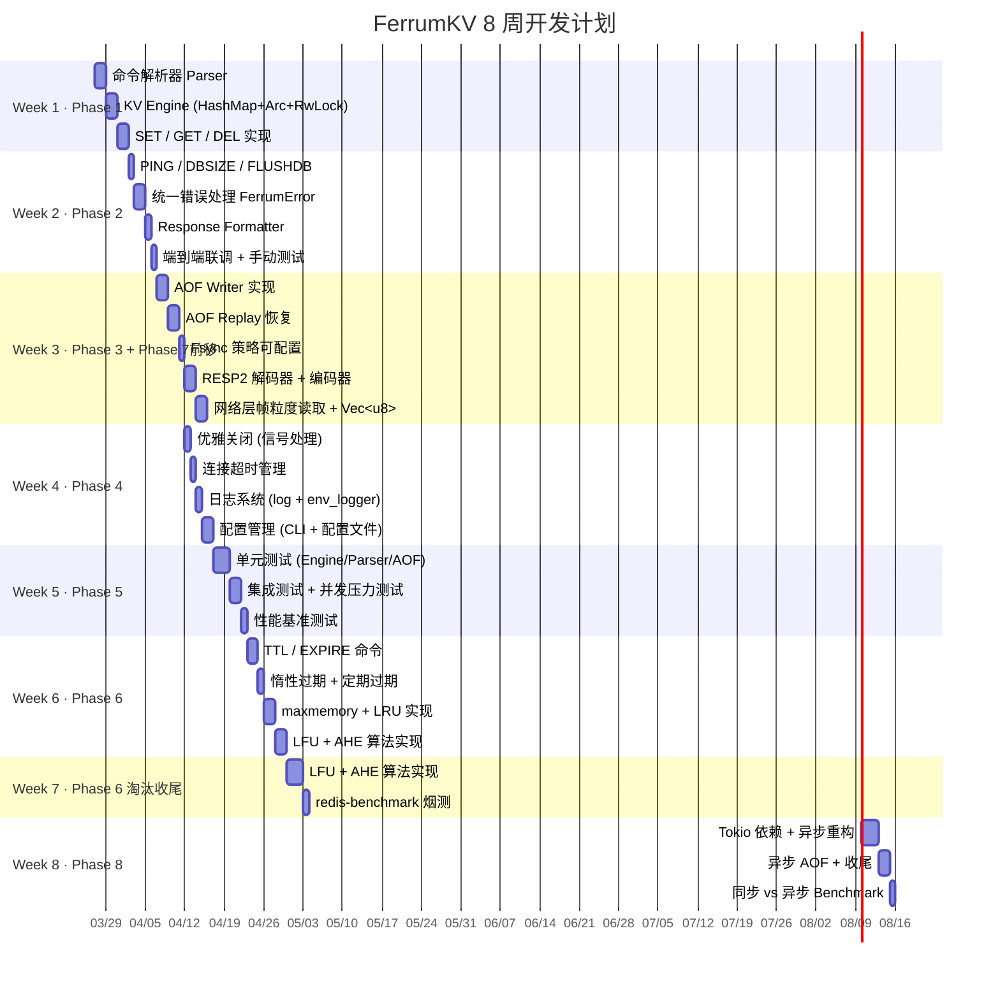
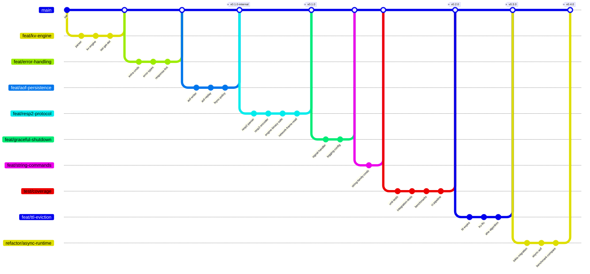
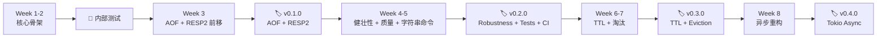

# FerrumKV 开发计划

> 📅 计划周期：2 个月（8 周）
> ⏰ 每日投入：1~1.5 小时（工作日），周末可弹性加码
> 🎯 目标：完成白皮书 Phase 1 ~ Phase 8 全部功能

---

## 📊 总览



---

## 🌿 Git 分支策略

### 分支模型



### 分支命名规范

**前缀规则**：
- `feat/` — 新功能开发
- `test/` — 测试相关
- `refactor/` — 重构改造
- `fix/` — 缺陷修复（按需创建）
- `docs/` — 文档更新（按需创建）

### 🔑 分支命名核心原则（强约束）

1. **按模块/能力命名，不按 phase / week 序号**
   - ✅ 正确：`feat/kv-engine`、`feat/command-semantics`、`feat/aof-persistence`
   - ❌ 错误：`feat/phase2`、`feat/week3`、`feat/phase2-complete`
   - 理由：phase/week 只是时间规划，会随实际进度漂移；模块名才是代码结构上真正稳定的标识。
2. **使用小写短横线连字符**（kebab-case），不使用下划线或驼峰。
3. **一个分支只做一件事**：聚焦单一模块或单一能力，便于独立 review、独立回滚、独立打 tag。
4. **跨模块的改动，以主导模块命名**：例如某次改动同时动了 `protocol/` 与 `error/`，但重心在命令语义，则取名 `feat/command-semantics`，而非拼接两个模块名。
5. **master（main）分支只接受合并，不直接提交**：所有开发必须走特性分支 → PR / `merge --no-ff`。

### 分支命名一览

> 下表中的 **分支名** 是按本项目模块结构固化的命名，与 Phase / Week 仅为松耦合映射关系；实际开发若出现跨 phase 的模块级改动，以模块名为准即可。

| 周次 | Phase | 分支名 | 对应模块 | 功能描述 | 合并后 Tag |
| ---- | ----- | ------ | -------- | -------- | ---------- |
| Week 1 | Phase 1 · 核心骨架 | `feat/kv-engine` | `storage/` + `protocol/` | KV 存储引擎 + 命令解析器 | — |
| Week 1+ | Phase 1 · 网络层 | `feature/tcp-server-base` | `network/` | TCP 监听 + 行协议骨架 | — |
| Week 2 | Phase 2 · 命令语义 | `feat/command-semantics` | `protocol/` + `error/` + `storage/` 校验 | 命令补全（EXISTS / PING msg / DEL 整数语义）+ 错误分层 + 输入校验 | — |
| Week 3 | Phase 3 · 持久化 | `feat/aof-persistence` | `persistence/`（新增） | AOF 写入 / 重放 / Fsync | — |
| Week 3 | Phase 7 · RESP2 （前移） | `feat/resp2-protocol` | 重写 `protocol/` + `storage/` value 升位 | RESP2 唯一线协议 + `Vec<u8>` 二进制安全 | **`v0.1.0`** |
| Week 4 | Phase 4 · 运行时健壮性 | `feat/graceful-shutdown` | `network/` + `main.rs` | 优雅关闭 + 连接超时 | — |
| Week 4 | Phase 4 · 可观测性 | `feat/logging-config` | 新增 `config/` + 日志 | `log` / `env_logger` + 配置文件 | — |
| Week 4+ | 增量补充 | `feat/string-commands` | `protocol/` + `storage/` + `persistence/` | `APPEND` / `STRLEN` / `SETNX` / `MSET` / `MGET` / `INCR*` / `DECR*` / 可变参 `DEL` | — |
| Week 5 | Phase 5 · 质量保障 | `test/coverage` | `tests/` + `benches/` + `.github/workflows/` | 单元/集成/并发压测 + Criterion 基准 + CI | **`v0.2.0`** |
| Week 6 | Phase 6 · 键过期 | `feat/expire-ttl` | `storage/` | TTL / EXPIRE / 惰性 + 定期过期 | — |
| Week 6 | Phase 6 · 内存淘汰 | `feat/memory-eviction` | `storage/` + 新增 `eviction/` | LRU / LFU / AHE 算法 | — |
| Week 7 | Phase 6 · 淘汰收尾 | `feat/memory-eviction-advanced` | `eviction/` | LFU / AHE + redis-benchmark | **`v0.3.0`** |
| Week 8 | Phase 8 · 异步运行时 | `refactor/async-runtime` | `network/` + `persistence/` | Tokio 异步重构 | **`v0.4.0`** |

> 💡 **允许拆分**：若某个模块分支工作量过大（例如 Week 6 的 TTL + 3 种淘汰算法），可从母分支再切子分支（如 `feat/expire-ttl`、`feat/memory-eviction`），完成后先合回母分支或直接合回 `master`，避免单个分支积压过多改动。

### 分支操作流程

每周开始时：
```bash
# 1. 确保 main 是最新的
git checkout main
git pull origin main

# 2. 创建本周分支（以 Week 1 为例）
git checkout -b feat/kv-engine
```

每周结束时：
```bash
# 1. 确保所有测试通过
cargo test

# 2. 合并回 main（以 Week 1 为例）
git checkout main
git merge --no-ff feat/kv-engine -m "feat: implement core KV engine with command parser"

# 3. 如果是版本节点，打 tag
git tag -a v0.1.0 -m "Core KV Engine + AOF + Tests"

# 4. 推送
git push origin main --tags
```

### 临时分支（可选）

如果某个 Phase 内部任务较大，可以从母分支再切子分支（同样按模块/能力命名）：

```bash
# 例如 Week 6 工作量大，拆分为两个平级分支，分别合回 master
git checkout master
git checkout -b feat/expire-ttl         # 子任务：TTL 过期机制 (storage/)
# …… 开发、测试、合并 ……

git checkout master
git checkout -b feat/memory-eviction    # 子任务：LRU/LFU/AHE 淘汰 (eviction/)
```

---

## 📌 当前进度

| 项目 | 状态 |
| ---- | ---- |
| 项目骨架搭建（network / protocol / storage / error 模块） | ✅ 已完成 |
| TCP Server 监听 + 多线程连接处理 | ✅ 已完成 |
| 命令解析器 `protocol::parser`（SET / GET / DEL / PING / Unknown） | ✅ 已完成 |
| KV Engine `storage::engine`（Arc\<RwLock\<HashMap\>\>） | ✅ 已完成 |
| 统一错误类型 `FerrumError`（IoError / ParseError / StorageError / PersistenceError） | ✅ 已完成 |
| Response Formatter `format_response()` | ✅ 已完成 |
| lib.rs 抽取（支持集成测试） | ✅ 已完成 |
| 单元测试（Parser + Engine） | ✅ 已完成 |
| 集成测试（SET+GET / DEL / PING 端到端） | ✅ 已完成 |
| Clippy lint 全部通过 | ✅ 已完成 |
| DBSIZE / FLUSHDB 命令 | ✅ 已完成 |
| 所有 Engine 方法返回 Result + `?` 错误传播 | ✅ 已完成 |
| `From<PoisonError>` 锁中毒错误转换 | ✅ 已完成 |
| `execute_command` 公开为端到端测试入口 | ✅ 已完成 |
| 端到端集成测试（所有命令 + 异常输入 + 并发） | ✅ 已完成 |
| EXISTS 命令 + DEL integer 语义 + Key/Value 长度校验（Phase 2 收尾） | ✅ 已完成 |
| AOF Writer / Replay / Fsync / 折断截断（Phase 3） | ✅ 已完成 |
| RESP2 单一线协议 + `Vec<u8>` 二进制安全（Phase 7 前移，分支 `feat/resp2-protocol`） | ✅ 已完成 |
| CLI 参数解析（`--addr` / `--aof-path` / `--appendfsync`） | ✅ 已完成 |
| 冒烟验证：`redis-cli` 兼容 + 二进制安全 + AOF 重启回放 | ✅ 已完成 |
| 优雅关闭 + 连接超时 + 最大连接数（Phase 4 健壮性） | ✅ 已完成 |
| 日志系统 `log` + `env_logger`（Phase 4 可观测性） | ✅ 已完成 |
| 配置文件 `ferrum.conf` + CLI 覆盖（Phase 4 可观测性） | ✅ 已完成 |
| 字符串扩展命令：`APPEND` / `STRLEN` / `SETNX` / `MSET` / `MGET` / `INCR*` / `DECR*` / 可变参 `DEL` | ✅ 已完成 |
| 单元测试 + 集成测试（含二进制安全、AOF 往返、优雅关闭） | ✅ 已完成 |
| 多客户端并发压力测试套件 | ✅ 已完成 |
| Criterion 微基准（engine + RESP2） + 原生冒烟压测脚本 | ✅ 已完成 |
| GitHub Actions CI（fmt / clippy / test / bench build） | ✅ 已完成 |
| TTL 过期：`EXPIRE` / `PEXPIRE` / `PEXPIREAT` / `PERSIST` / `TTL` / `PTTL` + 惰性过期 + 主动扫描（Phase 6-A） | ✅ 已完成 |
| 内存追踪 + `maxmemory` + 采样 LRU + `volatile_ttl` / `*_random` / `noeviction` + `MEMORY USAGE` + `INFO memory`（Phase 6-B） | ✅ 已完成 |
| LFU 淘汰（`allkeys_lfu` / `volatile_lfu`）（Phase 6-C） | ✅ 已完成 |
| AHE 自适应混合淘汰 + `redis-benchmark` 烟测（Phase 6-C） | ✅ 已完成 |
| Tokio 异步运行时（Phase 8） | ✅ 已完成 |

---

## 🗓️ 每周详细计划

### Week 1（Phase 1 · 核心骨架） ✅ 已完成

> 🌿 分支：`feat/kv-engine`（已合并）

> 🎯 目标：实现最小可用的 KV 存储，能通过 nc 进行 SET/GET/DEL

| 天 | 任务 | 产出 | 预计时间 |
| -- | ---- | ---- | -------- |
| Day 1 | 搭建模块结构，创建 `network/`、`protocol/`、`storage/`、`error/` 目录 | 项目骨架 | 30min |
| Day 1 | 实现 `protocol::parser` —— 将原始字符串解析为 `Command` 枚举 | `Command::Set/Get/Del/Ping/Unknown` | 30min |
| Day 2 | 实现 `storage::engine` —— `KvEngine` 结构体封装 `Arc<RwLock<HashMap>>` | `set()`、`get()`、`del()` 方法 | 45min |
| Day 3 | 将 Parser + Engine 集成到 `main.rs` 的连接处理中 | 可通过 nc 执行 SET/GET/DEL | 45min |
| Day 4 | 代码整理 + 手动测试多客户端并发读写 | 确认并发安全 | 30min |

**关键文件变更**：
```
src/protocol/parser.rs   ← 新建
src/storage/engine.rs    ← 新建
src/error/kind.rs        ← 新建（错误类型定义）
src/error.rs             ← 新建（模块根，重导出）
src/main.rs              ← 重构
```

**验证方式**：
```bash
# Terminal 1
cargo run

# Terminal 2
echo "SET name ferrum" | nc 127.0.0.1 6380
echo "GET name" | nc 127.0.0.1 6380        # => ferrum
echo "DEL name" | nc 127.0.0.1 6380        # => OK
echo "GET name" | nc 127.0.0.1 6380        # => NULL
```

---

### Week 2（Phase 2 · 功能完整） ✅ 已完成

> 🌿 分支：`feat/command-semantics`（已合并）

> 🎯 目标：补齐基础命令，统一错误处理，响应格式规范化

| 天 | 任务 | 产出 | 预计时间 |
| -- | ---- | ---- | -------- |
| Day 1 | 实现 PING / DBSIZE / FLUSHDB 命令 | 扩展 Command 枚举 + Engine 方法 | 30min |
| Day 2 | 定义 `FerrumError` 枚举，实现 `From<io::Error>` 等转换 | 统一错误类型 | 45min |
| Day 3 | 将所有 `unwrap()` 替换为 `?` 操作符 + 错误传播 | 健壮的错误处理链 | 45min |
| Day 4 | 实现 Response Formatter，统一响应格式 | `OK` / `NULL` / `ERR <msg>` | 30min |
| Day 5 | 端到端联调，手动测试所有命令 + 异常输入 | 功能验证通过 | 30min |

**关键设计决策**：
- `FerrumError` 使用 `thiserror` crate 还是手动实现 `Display + Error`？
  - 建议：先手动实现（学习 trait），后续可切换到 `thiserror`

---

### Week 3（Phase 3 · 持久化 + Phase 7 · RESP2 前移） ✅ 已完成

> 🌿 分支：`feat/aof-persistence`（已合并）、`feat/resp2-protocol`（已合并）

> 🎯 目标：AOF 持久化 + RESP2 单一线协议，保证服务重启不丢数据、可被 redis-cli 直连

| 天 | 任务 | 产出 | 预计时间 |
| -- | ---- | ---- | -------- |
| Day 1 | 实现 `persistence::aof` —— AOF Writer（`Mutex<File>` 追加写入） | 写命令自动追加到 `.aof` 文件 | 45min |
| Day 2 | 将 AOF Writer 集成到 Engine 的 SET/DEL 流程中 | 每次写操作自动记录 | 45min |
| Day 3 | 实现 AOF Replay Loader —— 启动时逐行读取并重放 | 重启后数据恢复 | 45min |
| Day 4 | 实现 Fsync 策略（Always / EverySecond / No）+ 末尾半条截断 | 可配置的刷盘策略 | 60min |
| Day 5 | 端到端持久化测试（写入 → 重启 → 验证恢复） | 持久化验证通过 | 30min |
| Day 6 | 新分支 `feat/resp2-protocol`：RESP2 解析器（流式 `Array of Bulk Strings`）+ 响应编码器 | `protocol/parser.rs` + `protocol/encoder.rs` | 60min |
| Day 7 | `KvEngine` value 升位为 `Vec<u8>` + 网络层改为帧粒度读取；移除 `protocol_mode` 与 Simple 相关约束 | 二进制安全 + 单一线协议 | 60min |
| Day 8 | redis-cli / redis-benchmark 兼容验证 + 回归测试 | 兼容性确认 | 45min |

**验证方式**（RESP2 切换后）：
```bash
# Terminal 1: 启动服务（读取历史 AOF 恢复）
cargo run

# Terminal 2: 使用 redis-cli 直连验证
redis-cli -p 6380
127.0.0.1:6380> SET name ferrum
OK
127.0.0.1:6380> GET name
"ferrum"
127.0.0.1:6380> DEL name
(integer) 1
127.0.0.1:6380> DBSIZE
(integer) 0
```

---

### 📎 增量补充（`feat/string-commands`） ✅ 已完成

> 🌿 分支：`feat/string-commands`（从 `v0.1.0` tag 切出，已合并）

> 🎯 目标：在不改动现有 value 结构（留到 Week 6 做 TTL）的前提下，把字符串类高频命令补齐，让 FerrumKV 达到"可当迷你 Redis 用"的能力上限

**新增命令**：

| 命令 | 说明 | AOF 落盘策略（方案 A：记最终态） |
| --- | --- | --- |
| `APPEND key value` | 追加到已有值尾部，不存在则等价于 SET；返回新长度 | 落 `SET key <new_full_value>` |
| `STRLEN key` | 返回 value 字节数；不存在返回 `:0` | 不写 AOF |
| `SETNX key value` | 仅当 key 不存在时 SET；返回 `:1` / `:0` | 仅命中时落 `SET` |
| `MSET k v [k v ...]` | 原子批量 SET | `append_set_many` 一次性写整批，避免并发插入 |
| `MGET k [k ...]` | 批量 GET，缺失项用 `$-1` | 不写 AOF |
| `INCR` / `DECR` | 把 value 当 i64 自增/自减 `±1`；不存在从 0 起 | 落 `SET key <new_int_str>` |
| `INCRBY` / `DECRBY` | 带 delta 的自增/自减；错误消息对齐 Redis | 落 `SET key <new_int_str>` |
| `DEL key [key ...]`（升级） | 变可变参，返回实际删除数量 | 仅对存在的 key 逐条 append `DEL` |

**关键设计决策**：
- AOF 写入统一采用 **方案 A：记最终态**（把 `INCR` / `APPEND` 等都写成等价 `SET`）。理由：当前没有 AOF rewrite 机制，最终态写入天然幂等、回放绝对安全，也和 Redis `BGREWRITEAOF` 的产物等价。
- `MSET` 的原子性在 engine 层用单把写锁保证；AOF 层新增 `append_set_many(pairs)`，把整批记录先拼进一个 `Vec<u8>` 再一次 `write_all`，防止并发 appender 把其它命令切进来。
- `INCR/DECR` 复用同一个 `Command::IncrBy { key, delta }` 变体，parser 把四个命令统一归约成一个形状，执行路径只有一条。
- 溢出 / 非整数 value 一律返回 `-ERR value is not an integer or out of range`，完全对齐 Redis 的错误文本。
- `EXISTS` 继续保持单 key 语义，多 key 版本等到 Week 6 TTL 时一起做（届时 `EXISTS` 语义会涉及过期检查，一起重构更合适）。

---

### Week 4（Phase 4 · 健壮性） ✅ 已完成

> 🌿 分支：`feat/graceful-shutdown`（已合并）、`feat/logging-config`（已合并）

> 🎯 目标：生产级健壮性——优雅关闭、超时管理、日志、配置

| 天 | 任务 | 产出 | 预计时间 |
| -- | ---- | ---- | -------- |
| Day 1 | 信号处理（SIGINT/SIGTERM）+ `AtomicBool` shutdown flag | Ctrl+C 优雅关闭 | 45min |
| Day 2 | 连接超时管理（`set_read_timeout` / `set_write_timeout`） | 僵尸连接自动断开 | 30min |
| Day 3 | 集成 `log` + `env_logger`，替换所有 `println!` | 结构化日志输出 | 45min |
| Day 4 | 实现 `config::settings` —— 配置文件解析 + 命令行参数 | `ferrum.conf` 支持 | 60min |
| Day 5 | 实现 `max_connections` 限制 | 连接数控制 | 30min |

**新增依赖**：
```toml
[dependencies]
signal-hook = "0.3"
log = "0.4"
env_logger = "0.11"
```

**落地说明**：
- 优雅关闭：`network/shutdown.rs` 用 `Arc<AtomicBool>` 承载关闭标志，信号线程通过自连接 wake 阻塞中的 `accept`；accept 循环检测到标志后停止派发新连接，已有 worker 线程自然收敛到退出。
- 连接治理：`ServerConfig` 统一承载 `client_timeout` 与 `max_clients`；CLI 分别对应 `--client-timeout` / `--maxclients`，`0` 表示禁用/无限。
- 日志：`FERRUM_LOG` > `RUST_LOG` > `--loglevel` / `loglevel` 指令 > `info` 的过滤优先级，保证运维能随时临时调级不用改配置。
- 配置文件：手写的 Redis 风格 `key value` 解析器，未引入 toml/serde；目录为 `src/config/`，附 `ferrum.conf.example`。CLI 始终覆盖配置文件。

---

### Week 5（Phase 5 · 质量保障） ✅ 已完成

> 🌿 分支：`test/coverage`（已合并）

> 🎯 目标：完善测试体系，确保核心功能稳定可靠

| 天 | 任务 | 产出 | 预计时间 |
| -- | ---- | ---- | -------- |
| Day 1 | Parser 单元测试（合法/非法命令、边界情况） | `#[cfg(test)]` 模块 | 45min |
| Day 2 | Engine 单元测试（SET/GET/DEL/DBSIZE/FLUSHDB 正确性） | Engine 测试覆盖 | 45min |
| Day 3 | AOF 单元测试（写入格式、重放正确性、损坏行跳过） | AOF 测试覆盖 | 45min |
| Day 4 | 集成测试（端到端 TCP 测试、多客户端并发） | `tests/` 目录 | 60min |
| Day 5 | 并发压力测试 + 简单性能基准 | 压测脚本 + 结果记录 | 45min |

**测试命令**：
```bash
cargo test                    # 全部单元测试 + 集成测试
cargo bench --no-run          # 仅编译 Criterion 基准（CI 用）
cargo bench                   # 本地跑基准（engine + RESP2）
./scripts/bench-smoke.sh      # 原生冒烟压测（SET/GET/MIXED）
```

**落地说明**：
- 单元测试分布在 `src/**/mod.rs`、`src/protocol/{parser,encoder}.rs`、`src/storage/engine.rs`、`src/persistence/aof.rs`、`src/config/*.rs` 的 `#[cfg(test)]` 模块中，共 82 个用例。
- 集成测试位于 `tests/`：`integration_basic.rs`、`integration_binary_safe.rs`、`integration_aof.rs`、`integration_shutdown.rs`、`integration_concurrency.rs`，全部基于真实 TCP + RESP2 客户端。
- 基准测试位于 `benches/engine_bench.rs`、`benches/resp2_bench.rs`；冒烟压测位于 `benches/smoke_bench.rs` + `scripts/bench-smoke.sh`。
- `.github/workflows/ci.yml` 在每次 push 与 PR 上跑 `cargo fmt --check`、`cargo clippy -- -D warnings`、`cargo test`、`cargo bench --no-run`。

> 💡 **里程碑检查点**：Week 5 结束打了 **`v0.2.0`**（`v0.1.0` 已在 Week 3 作为 AOF + RESP2 前移里程碑使用）。
>
> ```bash
> git tag -a v0.2.0 -m "Phase 4 robustness + Phase 5 quality + String family commands"
> ```

---

### Week 6（Phase 6 · 内存管理与键过期） ✅ 已完成

> 🌿 分支：`feat/expire-ttl`（已合并）＋ `feat/memory-eviction`（已合并）

> 🎯 目标：实现 TTL 过期、LRU/LFU/AHE 缓存淘汰

| 天 | 任务 | 产出 | 预计时间 |
| -- | ---- | ---- | -------- |
| Day 1 | 升级 `ValueEntry` 结构体（添加 `created_at`、`last_accessed`、`expire_at`） | 存储结构升级 | 45min |
| Day 2 | 实现 EXPIRE / TTL 命令 + 惰性过期（GET 时检查） | 键过期基础功能 | 60min |
| Day 3 | 实现定期过期（后台线程周期扫描） | 主动清理过期键 | 45min |
| Day 4 | 实现 `maxmemory` 配置 + Memory Tracker | 内存使用追踪 | 30min |
| Day 4 | 实现 LRU 淘汰（HashMap + 双向链表） | LRU 策略可用 | 60min |
| Day 5 | 实现 LFU 淘汰（频率桶） | LFU 策略可用 | 60min |
| Day 6 | 实现 AHE 自适应混合淘汰算法（EPS 评分 + α 自适应） | AHE 策略可用 | 90min |
| Day 7 | 淘汰策略单元测试 + 集成验证 | 测试覆盖 | 45min |

**落地说明**：
- `ValueEntry` 升级为携带 `expire_at: Option<Instant>` 的结构；所有读写路径统一做惰性过期判断。
- 主动过期扫描在独立后台线程（100 ms 周期、每轮采样 20 个 volatile 键），关停时随 `Shutdown` 信号一起收敛。
- AOF 新增 `PEXPIREAT` / `PERSIST` 记录，用绝对毫秒时间戳保证重启回放时过期判定一致；回放阶段会静默丢弃已过期的键。
- 采用 **采样式 LRU**（每轮从目标集合里随机抽 `maxmemory_samples` 个键，挑 `idle` 最大者淘汰），实现于 `storage/eviction.rs`，对齐 Redis 的启发式做法。
- 内存追踪使用 `MemoryTracker`（近似估算：key 字节 + value 字节 + 固定开销），在每次写入/删除路径上做增量更新，避免全表扫描。
- 支持 5 种策略：`noeviction` / `allkeys_lru` / `allkeys_random` / `volatile_lru` / `volatile_random` / `volatile_ttl`（未命中策略时返回 Redis 兼容的 `OOM command not allowed` 错误）。
- 新增运维命令：`MEMORY USAGE key`、`INFO memory`（暴露 `used_memory` / `maxmemory` / `maxmemory_policy` / `evicted_keys` / `expired_keys`）。
- 配置项：`maxmemory`（支持 `16mb` / `1gb` 字面量）、`maxmemory_policy`、`maxmemory_samples`；CLI 同名参数覆盖配置文件。

> ⚠️ LFU / AHE 推迟到 Week 7 继续收尾，本周聚焦 TTL + LRU 基础盘。

---

### Week 7（Phase 6 · 淘汰收尾） ✅ 已完成

> 🌿 分支：`feat/memory-eviction-advanced`（已合并）

> 🎯 目标：完成 LFU + AHE 淘汰算法，跑通 redis-benchmark 烟测

| 天 | 任务 | 产出 | 预计时间 |
| -- | ---- | ---- | -------- |
| Day 1 | 实现 LFU 淘汰（Morris 对数计数器 + 分钟衰减） | `allkeys_lfu` / `volatile_lfu` | 60min |
| Day 2 | 实现 AHE 自适应混合淘汰（EPS 评分 + α 反馈） | `allkeys_ahe` / `volatile_ahe` | 90min |
| Day 3 | 淘汰策略单元测试 + 集成验证 | 11 个新单测 + 3 个端到端用例 | 45min |
| Day 4 | `redis-benchmark` 性能基线（4 组场景） | `benches/redis-benchmark.md` | 30min |
| Day 5 | `v0.3.0` 打 tag + 文档收尾 | 版本发布 | 30min |

**落地说明**：

- `EvictionPolicy` 新增 `allkeys_lfu` / `volatile_lfu` / `allkeys_ahe` / `volatile_ahe` 四个策略；命令名保持 Redis 同款短横线形式（`allkeys-lfu` / `allkeys-ahe`）。
- LFU 采用 **Morris 对数概率计数器**：`ValueEntry` 每个 entry 增加 `lfu_counter: u8`（0..=255，Redis 同款 `LFU_INIT_VAL = 5` 起步）+ `lfu_decay_minute: u16`（分钟粒度衰减戳），无分支每次读写维护；`probabilistic_increment` 按 `1/(baseline * 10 + 1)` 步进，热 key 不会提前饱和；`decayed_counter` 基于分钟差做惰性衰减，默认每分钟 -1。
- AHE 采用 **EPS 评分公式**：`alpha * recency + (1 - alpha) * infrequency + ttl_penalty`，对应三维信号：最近访问时间、Morris 频次、剩余 TTL（短 TTL 加权）。`AdaptiveHybridState` 以 64 次淘汰为一个窗口，根据全局命中率是否回退翻转 α 调整方向（1D 梯度搜索），α 被 clamp 在 `[0.05, 0.95]`。
- 可观测性：`INFO memory` 暴露 `ahe_alpha` / `ahe_last_hit_ratio`；`INFO stats` 暴露 `keyspace_hits` / `keyspace_misses`（read 路径 `GET` / `MGET` / `EXISTS` 埋点）。
- 性能基线（Apple M5 · loopback · `-n 100000 -c 50 -q`）：Baseline SET 58K / GET 61K；`-P 16` pipeline 场景 SET 366K / GET 373K；`allkeys-lfu` 与 `allkeys-ahe` 相对 baseline 波动 < 2%，证明采样式淘汰的 CPU 开销被摊平。完整结果见 [`benches/redis-benchmark.md`](../benches/redis-benchmark.md)。
- 新增 `feat/memory-eviction-advanced` 分支共 4 个提交（LFU/AHE 实现 / CLI + INFO 对接 / 端到端测试 / benchmark 结果），已合并到 `master` 并打 **`v0.3.0`** tag。

> 📌 由于 RESP2 协议已在 Week 3 前移落地，Week 7 不再重复做协议相关工作，腾出时间把 Phase 6 的淘汰算法彻底收尾。
>
> ⚠️ 版本号说明：`v0.1.0`/`v0.2.0` 已分别在 Week 3（AOF + RESP2）和 Week 5（健壮性 + 质量 + 字符串命令）打出，本节点顺延为 `v0.3.0`，Week 8 异步运行时顺延为 `v0.4.0`。

---

### Week 8（Phase 8 · 异步运行时 + 收尾） ✅ 已完成

> 🌿 分支：`refactor/async-runtime`（已合并）

> 🎯 目标：引入 Tokio 异步重构，完成项目收尾

| 天 | 任务 | 产出 | 预计时间 |
| -- | ---- | ---- | -------- |
| Day 1 | 添加 Tokio 依赖，`main()` → `#[tokio::main]` | 异步入口 | 30min |
| Day 2 | `TcpListener` → `tokio::net::TcpListener`，`thread::spawn` → `tokio::spawn` | 异步网络层 | 60min |
| Day 3 | `BufReader` → `tokio::io::BufReader`，异步读写 | 异步 IO | 60min |
| Day 4 | AOF 异步写入（`tokio::fs`） | 异步持久化 | 45min |
| Day 5 | 同步 vs 异步性能对比 Benchmark | 性能对比报告 | 45min |
| Day 6 | 代码清理、注释完善、最终测试 | 项目收尾 | 60min |

**新增依赖**：
```toml
[dependencies]
tokio = { version = "1", features = ["rt-multi-thread", "net", "io-util", "macros", "signal", "sync", "time"] }
```

**落地说明**：

- **Sync shell + async core**：`run_listener` 仍然接收 `std::net::TcpListener`，内部用 `tokio::runtime::Builder::new_multi_thread()` 起 runtime，再通过 `TcpListener::from_std` 注册到 reactor；对外同步 API 完全不变，原有 9 套集成测试零改动通过。
- **新增 `--io-threads N` / `io-threads N`**：CLI + 配置文件同名参数，`0` 代表按 CPU 核数自适应。
- **`Shutdown` 去除自连接 hack**：改用 `tokio::sync::Notify`，accept 循环用 `tokio::select! { _ = shutdown.notified() => …, res = listener.accept() => … }` 协同退出，代码更直白也更稳。
- **Engine 锁保持 `std::sync::RwLock`**：内存操作持锁 < 1µs，直接在 async 任务里调用是安全的，也与 mini-redis 的模式一致；避免了全局切 `tokio::sync::RwLock` 带来的 async 传染。
- **AOF / 过期扫描线程不动**：AOF everysec 已经有独立后台 flusher，always 模式的 fsync 是显式的耐久性取舍；过期扫描跑在独立 OS 线程上已经正确，不需要迁移。
- **新增 500-client 并发冒烟测试** `tests/async_concurrency_test.rs`：验证 tokio 版本能稳定承载原先同步模型承载不了的高连接数场景。
- **286 个测试全绿**（188 lib + 36 bin + 62 integration），`cargo fmt --check` / `cargo clippy -- -D warnings` / `cargo test` 全部通过。

**Benchmark 对比**（Apple M5 · macOS 26.4.1 · loopback · `-n 100000 -q`，详见 [`benches/redis-benchmark.md`](../benches/redis-benchmark.md)）：

| 场景 | 命令 | v0.3.0 同步模型 | v0.4.0 tokio | Δ |
| --- | --- | --- | --- | --- |
| `c=50` | SET / GET / INCR | 58K / 61K / 61K | 62K / 65K / 63K | +3~7% |
| `-P 16 c=50` | SET / GET / INCR | 366K / 373K / 376K | 351K / 379K / 382K | 抖动 |
| **`c=500`** | SET / GET | *线程爆炸* | **50K / 43K** | **新能力** |

> Pipelined 吞吐受限于 engine CPU，同步/异步差异在噪声内；`c=500` 才是 Phase 8 的实际收益——几百条 socket 复用到少数 worker 线程上，不再按连接数线性开 OS 线程。

> 💡 **最终里程碑**：
> ```bash
> git tag -a v0.4.0 -m "v0.4.0 - Phase 8: async runtime"
> ```

---

## 🏷️ 版本发布节点



| 版本 | 时间节点 | 包含内容 |
| ---- | -------- | -------- |
| 内部测试 | Week 2 末 | Phase 1 + 2（基础 KV 可用） |
| **v0.1.0** | **Week 3 末** | Phase 1~3 + Phase 7 前移（TCP + RESP2 + AOF） |
| **v0.2.0** | **Week 5 末** | Phase 4~5 + 字符串扩展命令（健壮性 + 测试/基准/CI） |
| **v0.3.0** | **Week 7 末** | Phase 6（TTL + 淘汰） |
| **v0.4.0** | **Week 8 末** | Phase 8（Tokio 异步运行时） |

---

## ⚡ 每日开发节奏建议

```
┌─────────────────────────────────────────────┐
│  📖 5min   回顾昨天进度 + 今天任务          │
│  💻 45min  核心编码                          │
│  🧪 10min  运行测试 / 手动验证              │
│  📝 5min   git commit + 记录进度            │
│  ─────────────────────────────────────────  │
│  总计：~65min / 天                           │
└─────────────────────────────────────────────┘
```

**Git 提交规范**：
```
feat: implement SET/GET/DEL commands
fix: handle empty command input
refactor: extract parser into separate module
test: add unit tests for KV engine
docs: update whitepaper with AHE algorithm
```

---

## 🚨 风险与应对

| 风险 | 概率 | 应对策略 |
| ---- | ---- | -------- |
| Week 6 工作量过大（TTL + 3 种淘汰算法） | 高 | AHE 可延后到 Week 7 前半段，与 RESP 并行推进 |
| Rust 生命周期/借用问题卡壳 | 中 | 先用 `clone()` 跑通，后续优化；善用 `Arc`/`Rc` |
| 异步重构改动面大 | 中 | 保留同步版本分支，异步在新分支开发 |
| 某天没时间写代码 | 高 | 周末补进度，保持周维度的节奏即可 |
| RESP 协议细节复杂 | 低 | 只支持 5 种基础类型，不追求完整兼容 |

---

## 📋 每周 Checklist 模板

每周开始时复制此模板，跟踪进度：

```markdown
### Week N Checklist

- [ ] 任务 1
- [ ] 任务 2
- [ ] 任务 3
- [ ] 本周测试全部通过
- [ ] 代码已提交并推送
- [ ] 回顾：本周学到了什么？
- [ ] 下周预告：需要提前了解什么？
```

---

## 🧭 开发优先级原则

1. **先跑通，再优化** —— 先用最简单的方式实现功能，确认正确后再重构
2. **先测试，再继续** —— 每完成一个模块，立即写测试验证
3. **先同步，再异步** —— Phase 1~7 用同步模型，Phase 8 再引入 Tokio
4. **先核心，再扩展** —— SET/GET/DEL 优先，EXPIRE/TTL/LRU 后续
5. **每天提交** —— 保持小步快跑的节奏，避免大量代码堆积

---

*Last updated: 2026-05-01 · v0.4.0 released · Week 8 (Tokio async runtime) merged into master*
