# FerrumKV 白皮书

---

## 文档信息

| 项目       | 值                                                                 |
| ---------- | ------------------------------------------------------------------ |
| 项目名称   | FerrumKV                                                           |
| 版本       | 0.4.0                                                              |
| 最后更新   | 2026-05-01                                                         |
| 状态       | Phase 1–8 已发布（最新 tag `v0.4.0`：Tokio 异步运行时上线）         |
| 仓库       | [ferrum-kv](https://github.com/phaethix/ferrum-kv)                 |
| 模块布局   | 目录 + `mod.rs`（Rust 2021+ 风格，`edition = "2024"`）             |

---

## 术语表

| 术语   | 说明                                             |
| ------ | ------------------------------------------------ |
| KV     | Key-Value，键值对存储模型                        |
| AOF    | Append-Only File，追加写日志持久化策略           |
| RESP   | Redis Serialization Protocol，Redis 序列化协议   |
| OOM    | Out Of Memory，内存溢出                          |
| QPS    | Queries Per Second，每秒查询数                   |
| fsync  | 强制将文件缓冲区数据刷写到磁盘的系统调用        |
| LRU    | Least Recently Used，最近最少使用淘汰策略        |
| LFU    | Least Frequently Used，最不经常使用淘汰策略      |
| TTL    | Time To Live，键的存活时间                       |
| Tokio  | Rust 异步运行时框架                              |
| AHE    | Adaptive Hybrid Eviction，自适应混合淘汰算法     |
| EPS    | Eviction Priority Score，淘汰优先级分数          |

---

## 1. 项目概述

FerrumKV 是一个基于 Rust 实现的轻量级、多线程 Key-Value 存储系统，协议层完全兼容 RESP2，可被 `redis-cli` / `redis-benchmark` 直接驱动。项目定位为系统编程学习载体，覆盖存储引擎、网络 I/O、异步运行时、缓存淘汰等主题。

> **Ferrum**（拉丁语：铁）—— 寓意坚固、高效、可靠。

### 设计目标

- **可运行** —— 开箱即用的 TCP KV 服务，兼容 Redis 客户端生态
- **可测试** —— 完整的单元测试、集成测试与 Criterion 基准
- **可扩展** —— 清晰的分层架构，便于功能迭代与策略替换

### 定义

> A lightweight, multi-threaded KV storage server written in Rust — built from scratch for systems programming practice.

---

## 2. 功能目标

### 2.1 核心功能

> 📌 命令返回值全部采用 **Redis 兼容语义**（integer 用于计数 / 布尔，bulk string 用于值，`nil` 用于不存在）。
> 所有响应统一使用 **RESP2** 编码：`+OK\r\n` / `$<len>\r\n<bytes>\r\n` / `:<int>\r\n` / `$-1\r\n`（nil）。

| 功能                | 返回语义                         | 说明                                |
| ------------------- | -------------------------------- | ----------------------------------- |
| `SET key value`              | `OK`                              | 设置键值对                                 |
| `SETNX key value`            | `<integer>` 0/1                   | 仅当 key 不存在时设置                      |
| `GET key`                    | `<value>` / `nil`                 | 获取指定 key 的值                          |
| `MSET k v [k v ...]`         | `OK`                              | 批量原子写入                                |
| `MGET key [key ...]`         | `Array<bulk or nil>`              | 批量读取，不存在的位置返回 nil             |
| `INCR` / `DECR` / `INCRBY` / `DECRBY` | `<integer>`               | 整数原子增减（统一走 `IncrBy` 语义）       |
| `APPEND key value`           | `<integer>` 追加后长度             | 字符串追加                                 |
| `STRLEN key`                 | `<integer>`                       | 值字节长度                                 |
| `DEL key [key ...]`          | `<integer>` 实际删除数量           | 删除一个或多个 key                         |
| `EXISTS key`                 | `<integer>` 0/1                   | 判断键是否存在                              |
| `PING [msg]`                 | `PONG` / `<msg>`                  | 健康检查；带参数时回显参数                 |
| `DBSIZE`                     | `<integer>` 键数量                | 返回当前存储的键数量                       |
| `FLUSHDB`                    | `OK`                              | 清空所有数据                                |
| `EXPIRE key secs`            | `<integer>` 0/1                   | 秒级 TTL 设置                              |
| `PEXPIRE key ms`             | `<integer>` 0/1                   | 毫秒级 TTL 设置                            |
| `PEXPIREAT key ms-ts`        | `<integer>` 0/1                   | 绝对毫秒时间戳 TTL                         |
| `PERSIST key`                | `<integer>` 0/1                   | 移除 TTL                                    |
| `TTL key`                    | `<integer>` 秒 / `-1` / `-2`      | 剩余 TTL（秒）                             |
| `PTTL key`                   | `<integer>` 毫秒 / `-1` / `-2`    | 剩余 TTL（毫秒）                           |
| `MEMORY USAGE key`           | `<integer>` 字节 / `nil`          | 单键估算内存占用                           |
| `INFO [section]`             | `Bulk String`                     | `server` / `memory` / `stats` / `keyspace` |
| 多客户端并发访问             | —                                 | Tokio M:N 任务模型                         |
| AOF 持久化                   | —                                 | 写命令以 RESP2 追加写入 `ferrum.aof`       |
| 重启恢复                     | —                                 | 启动时重放 AOF 日志，恢复内存状态          |
| 缓存淘汰                     | —                                 | 9 种 Redis 风格策略 + 自创 AHE             |
| RESP2 二进制安全协议         | —                                 | 唯一线协议，兼容 `redis-cli` / `redis-benchmark` |
| 异步运行时                   | —                                 | 基于 Tokio 的多线程 runtime（v0.4）        |

### 2.2 非目标

- ❌ 分布式系统（建议独立项目 `ferrum-cluster`）
- ❌ Raft / 一致性协议（建议独立项目 `ferrum-raft`）
- ❌ Redis 全命令兼容（仅实现 FerrumKV 定义的命令集，不追求 200+ 命令全覆盖）

### 2.3 已实现的演进路径

以下特性按里程碑已落地：

| 特性 | 实现版本 | 说明 |
| ---- | -------- | ---- |
| Redis 风格多策略淘汰（LRU / LFU / Random / TTL / NoEviction） | v0.2 | `allkeys-*` 与 `volatile-*` 双作用域 |
| 自适应混合淘汰（AHE） | v0.3 | 带 EPS 评分 + alpha 反馈控制器 |
| TTL / EXPIRE / PEXPIRE / PERSIST + 惰性到期 + 主动 sweeper | v0.2 | 毫秒精度，后台线程 sweep |
| async runtime（Tokio） | v0.4 | `run_listener` 内置多线程运行时 + `tokio::spawn` 每连接任务 |

---

## 3. 系统分层架构

### 3.1 全局分层架构图

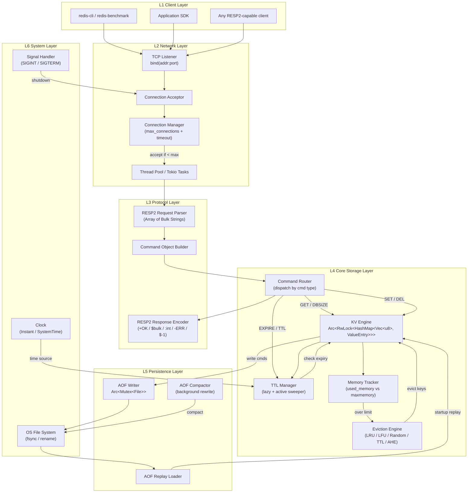

### 3.2 请求完整生命周期（SET 命令）

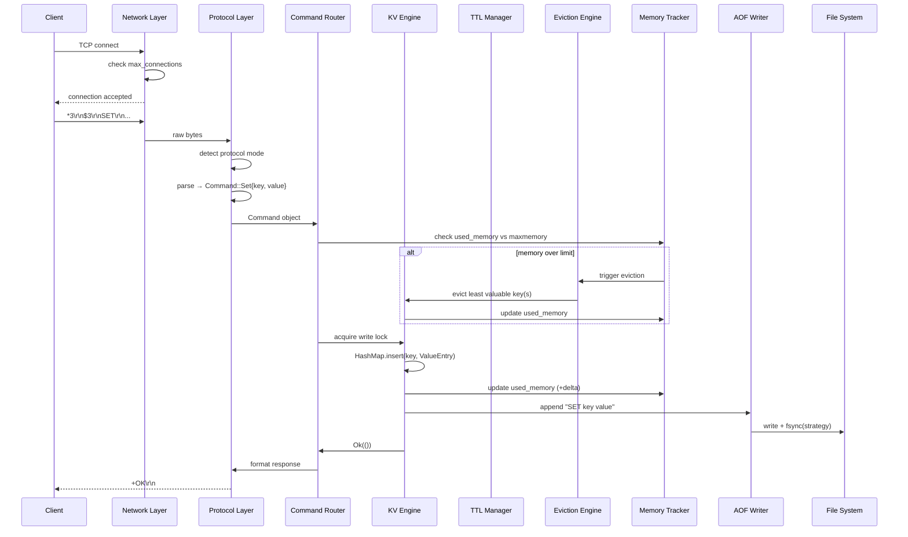

### 3.3 数据读取生命周期（GET 命令）

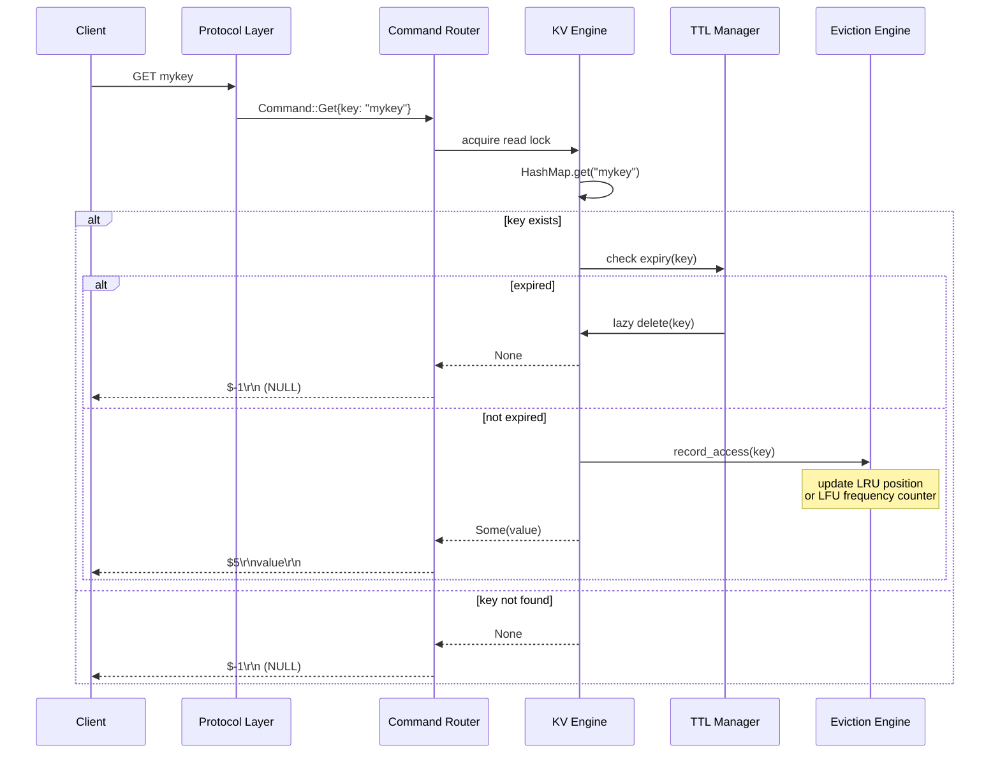

### 3.4 分层职责说明

| 层级                    | 职责                                                                 |
| ----------------------- | -------------------------------------------------------------------- |
| **L1 Client Layer**     | 发起 TCP 请求，接收响应（支持 redis-cli / nc / SDK）                 |
| **L2 Network Layer**    | TCP 连接管理、连接数限制、超时控制、线程/任务调度                    |
| **L3 Protocol Layer**   | RESP2 请求解析、命令对象构造、RESP2 响应编码                           |
| **L4 Core Storage**     | 命令路由、KV 读写、TTL 管理、缓存淘汰、内存追踪                     |
| **L5 Persistence**      | AOF 写入、AOF 重放恢复、AOF 后台压缩                                |
| **L6 System Layer**     | 文件系统 IO、信号处理、系统时钟                                      |

### 3.5 组件依赖关系图

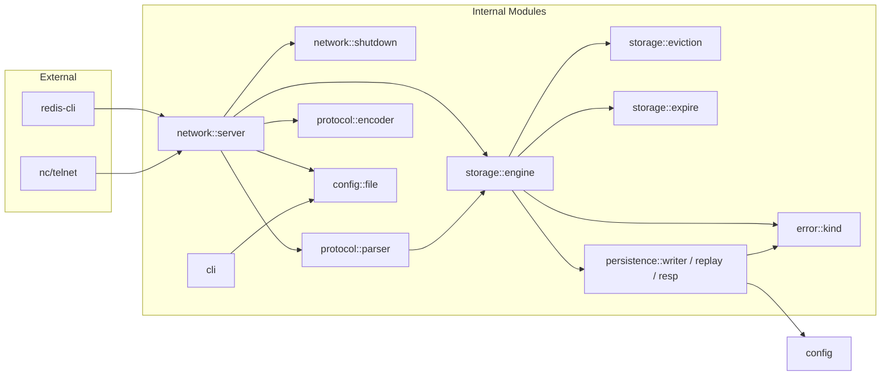

---

## 4. 模块结构

> 📌 **模块布局规范**：采用 Rust 2018+ 推荐的「目录 + `mod.rs`」风格，与当前仓库实际结构一致。

```text
src/
├── main.rs                   # Binary entry point, server bootstrap
├── lib.rs                    # Library root, re-exports public modules
├── cli.rs                    # Binary-local CLI parsing (not published by lib.rs)
├── network/
│   ├── mod.rs                # pub mod server; pub mod shutdown;
│   ├── server.rs             # Tokio-based async TCP server
│   └── shutdown.rs           # AtomicBool-backed shutdown notifier
├── protocol/
│   ├── mod.rs                # pub mod parser; pub mod encoder;
│   ├── parser.rs             # RESP2 streaming frame parser + Command enum
│   └── encoder.rs            # RESP2 response encoder (shared by server & AOF)
├── storage/
│   ├── mod.rs                # pub mod engine; pub mod eviction; pub mod expire;
│   ├── engine.rs             # KvEngine (HashMap<Vec<u8>, ValueEntry>) + TTL + memory accounting
│   ├── eviction.rs           # EvictionPolicy / Candidate / AHE controller (single file)
│   └── expire.rs             # Active TTL sweeper thread (adaptive sampling)
├── persistence/
│   ├── mod.rs                # pub mod config; pub mod replay; (resp/writer private)
│   ├── config.rs             # AofConfig + FsyncPolicy
│   ├── resp.rs               # Command → RESP2 byte encoding for the AOF
│   ├── writer.rs             # AofWriter (Mutex<BufWriter<File>>) + fsync policies
│   └── replay.rs             # Startup replay + torn-tail truncation
├── config/
│   ├── mod.rs                # pub mod file;
│   └── file.rs               # Redis-style config file parser
└── error/
    ├── mod.rs                # pub use kind::FerrumError;
    └── kind.rs               # Unified error enum (see §7)
```

> ⏬ **技术选型简记**：
> - `eviction/` 子模块合并为单文件 `storage/eviction.rs`，全部策略使用 **Redis-风格随机采样** + 评分，避免维护全局堆/链表。
> - `lib.rs` 只导出内部模块，`cli.rs` 直接随 `main.rs` 打包进 `ferrum-kv` 二进制。

---

## 5. 核心设计

### 5.1 存储结构

> 📌 **实现约束**：Key / Value 全程以 `Vec<u8>` 保留，确保 RESP2 Bulk String 的二进制安全语义。HashMap 值侧封装为 `ValueEntry`，承载 TTL 和 LFU/LRU 元数据。

```rust
use std::collections::HashMap;
use std::sync::{Arc, RwLock};
use std::time::Instant;

/// Stored value + per-key metadata (TTL, recency, LFU counter).
struct ValueEntry {
    data: Vec<u8>,
    expire_at: Option<Instant>,
    last_access: Instant,
    lfu_counter: u8,       // Morris counter, seeded at LFU_INIT_VAL (= 5)
    lfu_decay_minute: u16, // Minute-granularity timestamp for decay
}

pub struct KvEngine {
    store: Arc<RwLock<HashMap<Vec<u8>, ValueEntry>>>,
    aof: Option<Arc<AofWriter>>,
    used_memory: Arc<AtomicU64>,
    eviction: Arc<RwLock<EvictionConfig>>,
    hits: Arc<AtomicU64>,
    misses: Arc<AtomicU64>,
    ahe: Arc<Mutex<AdaptiveHybridState>>,
    rng: Arc<AtomicU32>, // xorshift32 for sampling & Morris probability
}
```

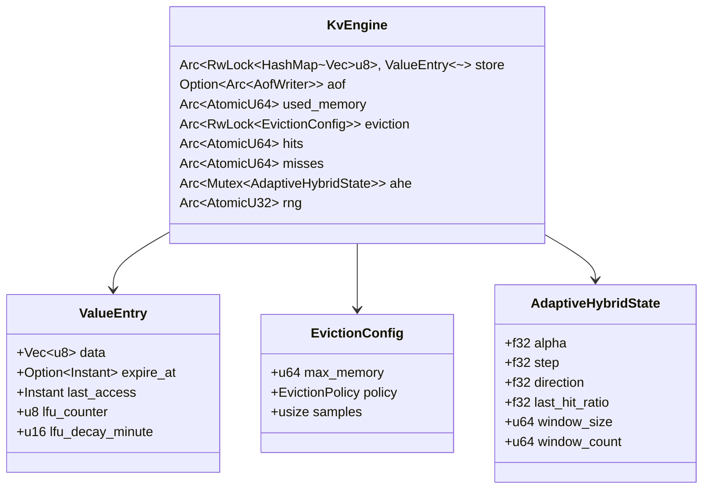

### 5.2 并发模型

> 📌 v0.4 起网络层迁移到 **Tokio 多线程运行时**。`run_listener` 内部构造 `Builder::new_multi_thread()`，每条客户端连接由 `tokio::spawn` 托管为一个轻量级任务（注意视角下的“一连接一线程”已不再成立）。

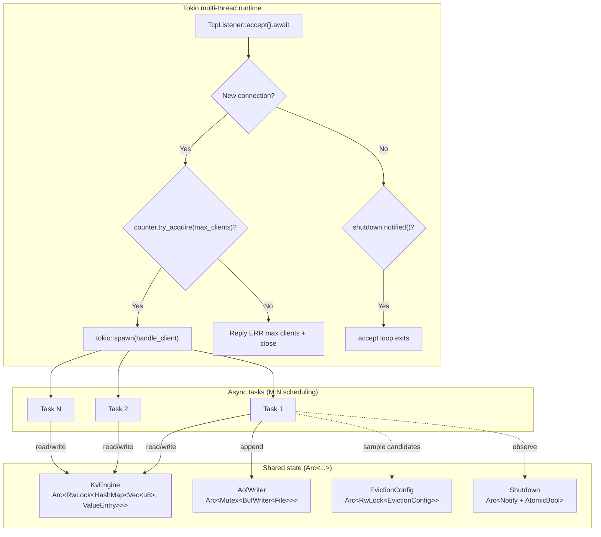

- **Tokio runtime** —— `rt-multi-thread` feature，`--io-threads N` 可显式设置 worker 数
- **tokio::spawn** —— 代替 `std::thread::spawn`，每连接开销从数 MB 降到数 KB
- **Arc + RwLock** —— `KvEngine` 内部仍用同步锁，任务持锁窗口短且不跨 await 点，避免死锁
- **Arc + Mutex** —— `AofWriter` 用 `std::sync::Mutex` 保护顺序写入，持锁区间不含 `.await`
- **Shutdown** —— `AtomicBool` + `tokio::sync::Notify`，接受循环通过 `tokio::select!` 最快感知退出

### 5.3 命令流转

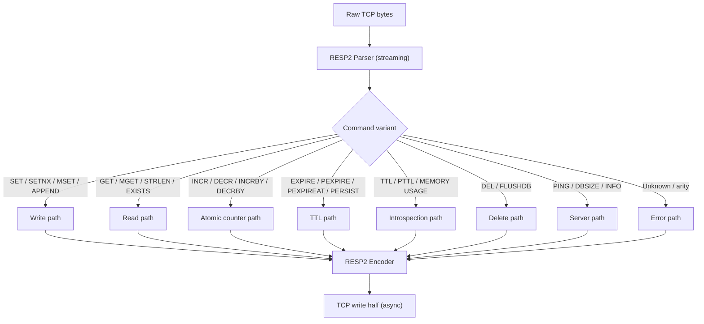

---

## 6. 协议规范

FerrumKV 使用 **RESP2**（Redis Serialization Protocol v2）作为唯一线协议。所有请求 / 响应均为二进制安全，支持任意字节（包括 `\n`、`\0` 等）作为 key / value。

### 6.1 RESP2 请求 / 响应

- 请求：`Array of Bulk Strings`，形如 `*<N>\r\n$<len>\r\n<bytes>\r\n...`
- 响应：`Simple String` / `Error` / `Integer` / `Bulk String` / `Null Bulk`
- 命令名大小写不敏感，服务端统一转大写后分发
- 详细编解码与兼容性说明见 §10

### 6.2 命令定义

> 返回值按 **RESP2** 语义给出；编码细节见 §10。

| 命令                              | 参数数量 | 返回值                               | 说明                                  |
| --------------------------------- | -------- | ------------------------------------ | ------------------------------------ |
| `SET key value`                   | 2        | `+OK`                                | 设置键值对                            |
| `SETNX key value`                 | 2        | `:0` / `:1`                          | 仅当 key 不存在时设置                     |
| `GET key`                         | 1        | `$<value>` / `$-1`（nil）             | 获取值                                |
| `MSET k v [k v ...]`              | 2N       | `+OK`                                | 批量原子写入                          |
| `MGET key [key ...]`              | ≥1       | `*N` 中每位为 bulk 或 `$-1`          | 批量读取                              |
| `INCR key` / `DECR key`           | 1        | `:<new>`                             | 等价于 `INCRBY key ±1`                 |
| `INCRBY key delta` / `DECRBY key delta` | 2   | `:<new>`                             | 整数原子增减，内部统一走 `IncrBy` 分支     |
| `APPEND key value`                | 2        | `:<len>` 追加后长度                   | 字符串追加                              |
| `STRLEN key`                      | 1        | `:<len>`                             | 值字节长度                              |
| `DEL key [key ...]`               | ≥1       | `:<count>`                           | 实际删除的 key 数量                    |
| `EXISTS key`                      | 1        | `:0` / `:1`                          | 判断键是否存在                          |
| `PING [msg]`                      | 0–1     | `+PONG` 或 `$<msg>`                  | 健康检查；带参数时回显参数              |
| `DBSIZE`                          | 0        | `:<count>`                           | 返回当前键数量                          |
| `FLUSHDB`                         | 0        | `+OK`                                | 清空所有数据                            |
| `EXPIRE key secs`                 | 2        | `:0` / `:1`                          | 秒级 TTL 设置                           |
| `PEXPIRE key ms`                  | 2        | `:0` / `:1`                          | 毫秒级 TTL 设置                         |
| `PEXPIREAT key ms-ts`             | 2        | `:0` / `:1`                          | 绝对毫秒时间戳 TTL                      |
| `PERSIST key`                     | 1        | `:0` / `:1`                          | 移除已有 TTL                           |
| `TTL key`                         | 1        | `:<sec>` / `:-1`（永久） / `:-2`（不存在） | 剩余 TTL（秒）                        |
| `PTTL key`                        | 1        | `:<ms>` / `:-1` / `:-2`              | 剩余 TTL（毫秒）                      |
| `MEMORY USAGE key`                | 2        | `:<bytes>` / `$-1`                   | 单键占用的估算内存字节数；不存在时返回 nil |
| `INFO [section]`                  | 0–1     | `$<bulk>`                            | `server` / `memory` / `stats` / `keyspace`之一或全部 |

### 6.3 错误响应格式

所有错误响应以 `ERR` / `OOM` / `WRONGTYPE` 前缀开头（当前实现仅产生 `ERR` 和 `OOM`，`WRONGTYPE` 预留给后续类型系统）：

| 分类             | 前缀              | 示例                                                |
| ---------------- | ----------------- | --------------------------------------------------- |
| 语法/解析错误    | `ERR`             | `ERR unknown command: 'FOOBAR'`                     |
| 参数错误         | `ERR`             | `ERR wrong number of arguments for 'SET' command`   |
| Key/Value 超限   | `ERR`             | `ERR key too long (65537 bytes, max 65536)`         |
| 类型错误（预留）   | `WRONGTYPE`       | `WRONGTYPE Operation against a key holding the wrong kind of value` |
| 内存不足         | `OOM`             | `OOM command not allowed when used memory > maxmemory` |
| 内部错误         | `ERR`             | `ERR lock poisoned: ...` / `ERR internal error: ...` |
| 持久化错误       | `ERR`             | `ERR persistence error: disk full`                  |

服务器在写入 Simple Error 前会将错误消息中的 `\r` / `\n` 替换为空格，遵循 RESP2 单行约束。

### 6.4 Key / Value 约束

| 约束项       | 限制                                               |
| ------------ | -------------------------------------------------- |
| Key 长度     | 1 ∼ 65536 bytes（64 KB）                           |
| Value 长度   | 0 ∼ 16 MB                                          |
| Key 字符集   | 任意字节（RESP2 Bulk String，二进制安全）                                         |
| Value 字符集 | 任意字节（RESP2 Bulk String，二进制安全）                                         |

---

## 7. 错误处理设计

### 7.1 错误类型枚举

当前 `FerrumError` 枚举定义于 [error/kind.rs](/Users/huanyuli/github.com/ferrum-kv/src/error/kind.rs)：

```rust
/// Unified error type for FerrumKV
#[derive(Debug)]
pub enum FerrumError {
    // ─── Infrastructure errors ───
    IoError(std::io::Error),
    LockPoisoned(String),
    /// Invariant violation or runtime setup failure.
    Internal(String),

    // ─── Protocol errors ───
    ParseError(String),
    UnknownCommand(String),
    WrongArity { cmd: &'static str },

    // ─── Storage errors ───
    KeyTooLong { len: usize, max: usize },
    ValueTooLarge { len: usize, max: usize },
    /// Memory limit reached under the `noeviction` policy.
    OutOfMemory,

    // ─── Persistence errors ───
    PersistenceError(String),
}
```

`std::io::Error` 和 `PoisonError<T>` 已通过 `From` 实现自动映射，`?` 运算符可直接在引擎 / 网络层使用。

### 7.2 错误传播策略

| 层级             | 策略                                           |
| ---------------- | ---------------------------------------------- |
| Network Layer    | 捕获 IO 错误，记录日志，断开连接               |
| Protocol Layer   | 返回 `ERR <message>` 给客户端                  |
| Storage Layer    | 向上传播，由 Protocol Layer 格式化响应          |
| Persistence      | 记录日志，不阻塞主流程（best-effort 写入）     |

### 7.3 错误处理流程

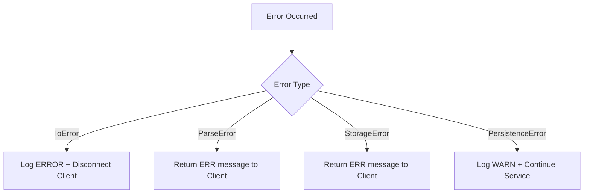

---

## 8. 持久化设计（AOF）

### 8.1 为什么选择 AOF

FerrumKV 采用 **AOF（Append-Only File）** 作为唯一的持久化方式：

- **实现简单**：仅需在写命令成功后追加一条记录
- **可读性强**：采用 RESP 格式，可直接用 `cat` / `redis-cli --pipe` 调试
- **恢复简单**：启动时只需顺序重放每条命令

### 8.2 日志格式（采用 RESP2）

> ⚠️ **重要设计决定**：AOF 文件统一使用 **RESP2 Array of Bulk Strings** 编码。原因：
> 1. **二进制安全**：value 可以包含任意字节（包括 `\n`）。
> 2. **与网络线协议对齐**：FerrumKV 唯一线协议即为 RESP2，AOF 与网络层共享同一套编解码实现。
> 3. **工业标准**：Redis 先行方案，生态工具兼容。

每条写命令追加为一个 RESP Array：

```text
*3\r\n$3\r\nSET\r\n$4\r\nname\r\n$6\r\nferrum\r\n
*2\r\n$3\r\nDEL\r\n$4\r\nname\r\n
```

**当前持久化命令集**（调用 `AofWriter::append_command` 的分支）：

- 写入类：`SET` / `SETNX` / `MSET` / `APPEND` / `INCRBY`（`INCR` / `DECR` / `DECRBY` 均归一化为 `INCRBY`）
- TTL 类：`PEXPIREAT`（`EXPIRE` / `PEXPIRE` / `PEXPIREAT` 都收敛到绝对毫秒时间戳再写入，重放幂等）/ `PERSIST`
- 删除类：`DEL` / `FLUSHDB`
- 只读命令（`GET` / `MGET` / `EXISTS` / `STRLEN` / `TTL` / `PTTL` / `MEMORY USAGE` / `INFO` / `DBSIZE` / `PING`）**不**写入 AOF

`persistence/resp.rs` 封装了 `Command → RESP2` 的切换逻辑；`persistence/writer.rs` 通过 `BufWriter + Mutex` 保证追加顺序。

### 8.3 写入流程

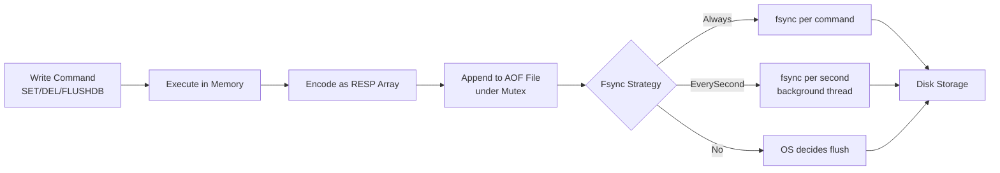

### 8.4 恢复流程

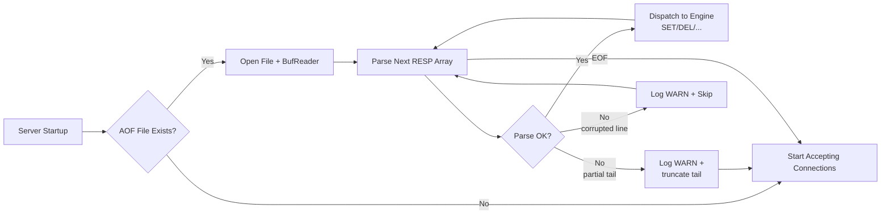

**关键设计点**：

- 逐条解析 RESP Array，解析失败记录 `WARN` 后继续（完整性善后）
- 文件末尾若出现半条记录（常见于崩溃），截断到最后一条完整命令结束处
- 恢复期间 **不写入 AOF**（避免重复追加）

### 8.5 写入策略

| 策略          | 说明                       | 数据安全性 | 性能 |
| ------------- | -------------------------- | ---------- | ---- |
| `always`      | 每条命令后 fsync           | ⭐⭐⭐     | ⭐   |
| `everysec`    | 后台线程每秒 fsync（**默认**） | ⭐⭐       | ⭐⭐ |
| `no`          | 由 OS 决定刷盘时机            | ⭐         | ⭐⭐⭐ |

### 8.6 AOF Compaction（还未实现，预留扩展）

当 AOF 文件超过阈值时，可通过重写压缩：

1. 快照当前内存状态
2. 生成最小化的命令序列（每个存活 key 一条 `SET` + 可选 `PEXPIREAT`）
3. 写入新文件后原子 `rename` 替换旧文件

> 目前 `ferrum-kv` 实现仅支持启动时完整重放，压缩机制计划在后续版本（见 §22 Roadmap）加入。

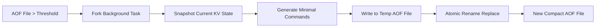

### 8.7 并发写入安全

- `AofWriter` 持有 `Arc<Mutex<BufWriter<File>>>`，与 KV 读写锁解耦
- 写命令的正确顺序：
  1. 获取 KV 写锁 → 修改内存
  2. 释放 KV 写锁前追加 AOF（获取 AOF mutex）
  3. 同步/异步 fsync。
- 这保证“内存可见”与“AOF 已写入”的顺序不被并发打乱，避免恢复后出现相反的操作顺序。

---

## 9. 内存管理与缓存淘汰设计

### 9.1 设计目标

当内存使用超过 `maxmemory` 限制时，自动淘汰低优先级的键，防止 OOM 崩溃。

### 9.2 淘汰触发流程

> 📌 **前提条件**：淘汰逻辑 **仅当 `maxmemory > 0` 时有效**；默认配置 `maxmemory=0` 表示无限制，此时 `maxmemory-policy` 配置不生效。

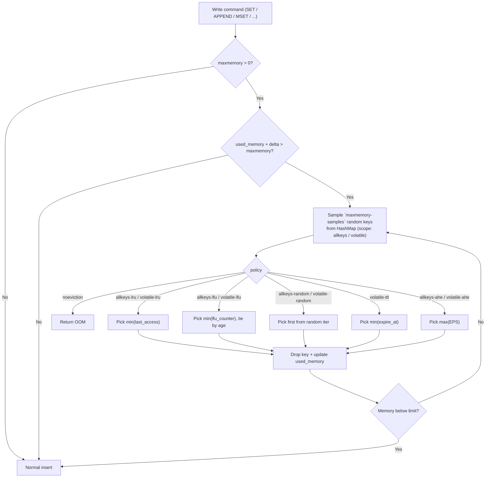

### 9.3 淘汰策略

全部 9 种策略与 Redis `maxmemory-policy` 同名，由 [storage/eviction.rs](/Users/huanyuli/github.com/ferrum-kv/src/storage/eviction.rs) 统一调度：

| 策略                 | 作用域    | 算法                                   | 适用场景                   |
| -------------------- | --------- | -------------------------------------- | ------------------------- |
| `noeviction`（默认）   | —         | 不淘汰，写命令返回 `OOM`            | 数据不可丢失场景         |
| `allkeys-lru`        | All keys  | 采样后取 `last_access` 最早             | 一般热点访问模式           |
| `volatile-lru`       | Volatile  | 同上，但仅限有 TTL 的 key           | 缓存 + 正常 KV 共存时的默认选择 |
| `allkeys-lfu`        | All keys  | 采样后取 `lfu_counter` 最低（平局按最旧访问） | 频率差异明显场景      |
| `volatile-lfu`       | Volatile  | 同上                                   | TTL key 的纯频率选择      |
| `allkeys-random`     | All keys  | 从随机迭代器取首位                    | 无先验分布时的底保       |
| `volatile-random`    | Volatile  | 同上                                   | 随机汰洗 TTL key         |
| `volatile-ttl`       | Volatile  | 取剩余 TTL 最短的 key               | 预期快过期的 key 优先清理  |
| `allkeys-ahe` 🚀      | All keys  | EPS 评分最高者淘汰，Alpha 自适应       | 混合变化负载             |
| `volatile-ahe` 🚀     | Volatile  | 同上                                   | TTL key 的自适应混合淘汰 |

所有策略都以 **随机采样** 方式选出候选集（默认 `maxmemory-samples = 5`），与 Redis 6+ 一致。样本越大越接近真 LRU/LFU，但每次淘汰成本也更高。

### 9.4 LRU / LFU 实现方案（采样法）

> 📌 **技术选型：与 Redis 保持一致的采样法**。FerrumKV 没有维护独立的 LRU 双向链表或 LFU 频率桶，而是由 `KvEngine` 为每个 key 在 `ValueEntry` 中内联 `last_access` 和 `lfu_counter` 字段，淘汰时随机抽样 `maxmemory-samples` 个 key 进行打分。原因：
>
> 1. Rust 的“HashMap + 双向链表”需要 `unsafe` 或 `Rc<RefCell>`，在多线程环境下复杂度高。
> 2. 淘汰是读写比大约 1000:1 的冷路径，采样法结果足够接近真 LRU/LFU。
> 3. Redis 6+ 的生产实践已验证方案有效。

**LRU（`allkeys-lru` / `volatile-lru`）**：

```rust
// eviction.rs (简化示意)
pick_victim(EvictionPolicy::AllKeysLru, candidates)
    .min_by_key(|c| c.last_access.unwrap_or(Instant::now()))
```

`last_access` 在每次 `GET` / `SET` / `INCRBY` 等触碰时通过 `touch_access` 更新。

**LFU（`allkeys-lfu` / `volatile-lfu`）**：采用 **Morris 计数器**（与 Redis 相同）：

- `lfu_counter: u8`，新 key 初始值 `LFU_INIT_VAL = 5`，防止刚创建就被淘汰。
- 访问时按 `p = 1 / (baseline * lfu_log_factor + 1)` 概率增长（`lfu_log_factor = 10`），计数越高增长越慢，类似对数递减。
- `lfu_decay_minute` 记录上次衰减的分钟时间戳，每分钟（`lfu-decay-time = 1`）对计数器 `saturating_sub(1)`。
- 淘汰时选择样本中 `lfu_counter` 最小的 key；同值时按 `last_access` 最早破平。

所有随机数来自引擎内置的 xorshift32 PRNG（`KvEngine.rng`），避免引入 `rand` 运行时依赖。

### 9.5 🚀 创新算法：Adaptive Hybrid Eviction（AHE）

> **FerrumKV 原创设计** —— 自适应混合淘汰算法，融合时间局部性（LRU）、访问频率（LFU）与 TTL 剩余生命周期，一个统一分数即可选出最应被驱逐的 key。并通过命中率反馈动态调整权重。

#### 9.5.1 设计动机

| 场景 | LRU 表现 | LFU 表现 | 问题 |
| ---- | -------- | -------- | ---- |
| 突发热点（如秒杀） | ✅ 好 | ❌ 新热点频率低被误淘汰 | LFU 冷启动问题 |
| 稳定高频访问 | ❌ 偶尔未访问就被淘汰 | ✅ 好 | LRU 无法识别长期价值 |
| 扫描污染（全表遍历） | ❌ 大量冷数据涌入驱逐热数据 | ✅ 好 | LRU 抗扫描能力差 |
| 键即将过期 | ❌ 会过度保护 | ❌ | 需要 TTL 感知 |
| 访问模式切换 | 固定策略无法适应 | 固定策略无法适应 | 需要自适应 |

**核心思想**：对采样中的每个键计算一个综合 **淘汰优先级分数（Eviction Priority Score, EPS）**，**分数最高者最应被淘汰**，后台根据命中率变化调整权重 `alpha`。

#### 9.5.2 EPS 评分公式

实际实现见 [`eps_score`](/Users/huanyuli/github.com/ferrum-kv/src/storage/eviction.rs)：

```text
EPS = alpha * recency + (1 - alpha) * infrequency + ttl_penalty
```

| 分量 | 公式 | 含义 |
| ---- | ---- | ---- |
| `recency`       | `min((now - last_access) / RECENCY_HORIZON, 1.0)`（`RECENCY_HORIZON = 600s`） | 越久未访问得分越高 |
| `infrequency`   | `1 - lfu_counter / 255`                                                        | 越冷得分越高 |
| `ttl_penalty`   | `+0.2` 当剩余 TTL ≤ 30s 或已过期；其他情况 `0`                          | 将要死亡的 key 加速退场 |
| `alpha`         | 自适应权重，`clamp(0.0, 1.0)`；控制器实际夹尺 `[0.05, 0.95]`                | `→ 1.0` 偏向 LRU，`→ 0.0` 偏向 LFU |

> **与早期设计的差别**：早期草稿采用 `log2` 频率归一化与 `1 / (1 + elapsed_sec)` 时间衰减，实际实现换成了与 LFU 共享的 Morris 计数器（`lfu_counter`）和线性 `recency` 梯度，避免额外维护 `access_count` / `max_access_count`，与 Redis 内置数据结构完全打通。

#### 9.5.3 自适应权重调整（Alpha 控制器）

`AdaptiveHybridState` 是一个基于命中率梯度的 1维搜索控制器：

```rust
pub struct AdaptiveHybridState {
    pub alpha: f32,            // 当前混合权重
    pub step: f32,             // 每次调整步长（默认 0.05）
    pub direction: f32,        // 上一次调整的符号，命中率回退时翻转
    pub last_hit_ratio: f32,   // 上一个观测窗口的命中率
    pub window_size: u64,      // 每积累 N 个样本就调一次（默认 64）
    pub window_count: u64,
}
```

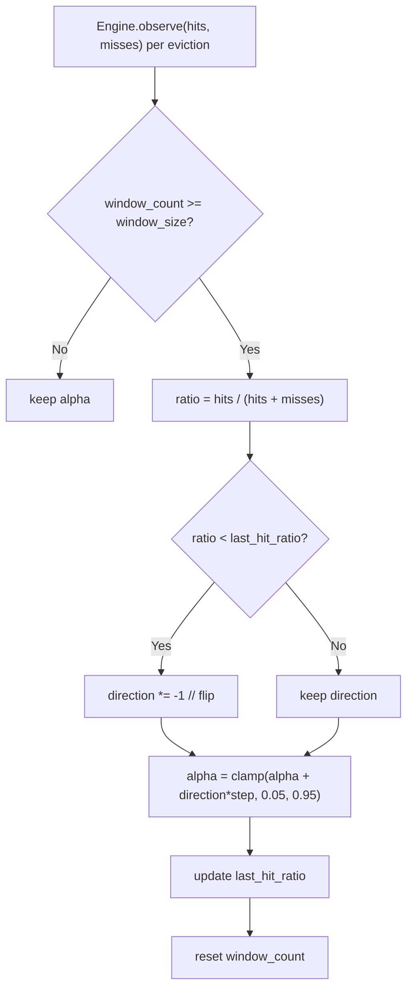

控制器特点：

- **关注命中率而非访问分布**：不需频率偏斜度等用户级指标，直接用 `keyspace_hits / (hits + misses)` 作为目标函数。
- **翻转式梯度下降**：只记录上次改动方向，命中率倒退时翻转符号，避免需要估算模型梯度。
- **护栏保护**：alpha 夹尺在 `[0.05, 0.95]`，避免退化成纯 LRU / 纯 LFU。
- **调用点**：`KvEngine::try_evict` 成功淘汰后调用 `observe(hits, misses)`，因此自适应频率与写入压力成正比。

#### 9.5.4 数据结构与淘汰步骤

因为 AHE 复用了与 LFU 相同的 Morris 计数器和 `last_access` 时戳，不需额外内存开销：

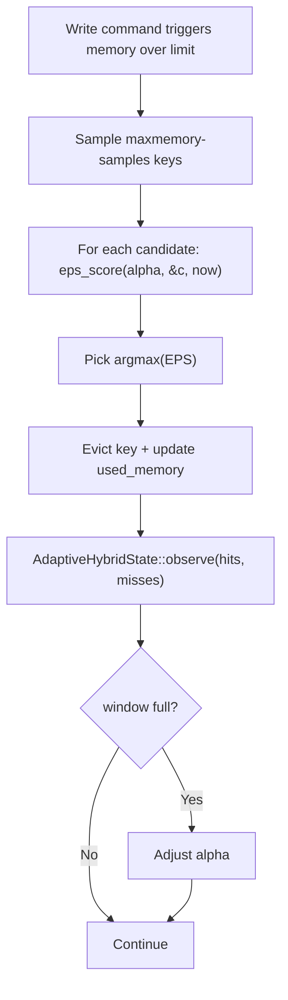

#### 9.5.5 与经典算法对比

| 维度 | LRU | LFU | **AHE（FerrumKV）** |
| ---- | --- | --- | -------------------- |
| 访问记录复杂度 | O(1) | O(1)（Morris 计数） | O(1) |
| 淘汰复杂度 | O(k) 采样 | O(k) 采样 | **O(k)**，k = `maxmemory-samples` |
| 额外内存 | — | — | —（复用 LFU 的 `lfu_counter` 与 `last_access`） |
| 突发热点适应 | ✅ | ❌ | ✅ 自适应 alpha 偏向 LRU |
| 稳定热点保护 | ❌ | ✅ | ✅ 自适应 alpha 偏向 LFU |
| 扫描污染抵抗 | ❌ | ✅ | ✅ 频率分数兜底 |
| TTL 感知 | ❌ | ❌ | ✅ `ttl_penalty` 优先清理即将过期 key |
| 模式切换适应 | ❌ | ❌ | ✅ 动态调整权重 |
| 可调参数 | 无 | `lfu-log-factor` / `lfu-decay-time` | alpha 初值、step、window_size、samples |

#### 9.5.6 配置项

| 配置项 | 默认值 | 说明 |
| ------ | ------ | ---- |
| `maxmemory-policy` | `noeviction` | 设为 `allkeys-ahe` / `volatile-ahe` 启用 |
| `maxmemory-samples` | `5` | 每次淘汰从 HashMap 里随机采样的键数，与其他 `*-lru` / `*-lfu` 策略共用一个旋钮 |

当前 `step` / `window_size` / `direction` 等 Alpha 控制器内部参数在代码中通过 `AdaptiveHybridState::default()` 硬编码（step=0.05，window=64），未暴露为 CLI/配置项。`INFO memory` 提供 `ahe_alpha` / `ahe_last_hit_ratio` 供观察收敛过程。

### 9.6 淘汰策略总览

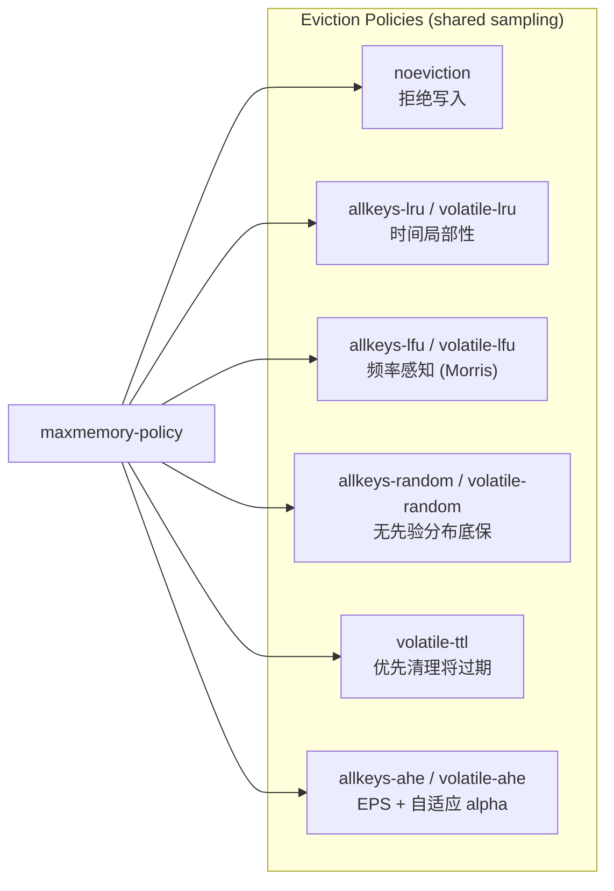

### 9.7 内存统计 (`INFO memory` / `INFO stats`)

| 指标                  | 来源                         | 说明                                |
| --------------------- | ---------------------------- | ----------------------------------- |
| `used_memory`         | `KvEngine::used_memory()`    | `key.len() + value.len() + PER_ENTRY_OVERHEAD` 的累积值 |
| `maxmemory`           | `EvictionConfig.max_memory`  | `0` 表示无限制                           |
| `maxmemory_policy`    | `EvictionConfig.policy`      | 9 种 Redis 风格策略之一                    |
| `maxmemory_samples`   | `EvictionConfig.samples`     | 每次采样的候选数                         |
| `ahe_alpha`           | `AdaptiveHybridState.alpha`  | 当前自适应权重                           |
| `ahe_last_hit_ratio`  | `AdaptiveHybridState.last_hit_ratio` | 上一次观测窗口的命中率                |
| `keyspace_hits`       | `KvEngine::keyspace_stats()` | 读命中数                             |
| `keyspace_misses`     | `KvEngine::keyspace_stats()` | 读未命中 / 键已过期数                  |
| `MEMORY USAGE key`    | `KvEngine::memory_usage()`   | 单键估算占用，不存在时返回 `$-1`          |

---

## 10. RESP2 协议实现

### 10.1 设计目标

采用 **RESP2**（Redis Serialization Protocol v2）作为 FerrumKV 唯一线协议，服务可被 `redis-cli` / `redis-benchmark` / 任意 Redis 客户端 SDK 直接驱动（`benches/redis-benchmark.md` 记录了每个版本的实测结果）。

> **范围约束**：
> 1. 不追求 Redis 全命令兼容（200+ 命令），仅实现§6.2 表格列出的 FerrumKV 命令集。
> 2. **仅兼容 RESP2**（Redis 6 之前）。RESP3 引入的新类型（`_` Null、`#` Boolean、`,` Double、`~` Set、`>` Push 等）暂不支持。
> 3. Inline commands（早期 redis-cli 用的明文行协议）不支持，所有请求必须以 `*` 开头。
> 4. 解析器（[protocol/parser.rs](/Users/huanyuli/github.com/ferrum-kv/src/protocol/parser.rs)）是流式的：缺失完整帧时返回 `FrameParse::NeedMore`，不预先剪付数据。

### 10.2 RESP2 数据类型

| 类型          | 前缀 | 示例                              | 说明             |
| ------------- | ---- | --------------------------------- | ---------------- |
| Simple String | `+`  | `+OK\r\n`                        | 简单字符串响应   |
| Error         | `-`  | `-ERR unknown command\r\n`       | 错误响应         |
| Integer       | `:`  | `:1024\r\n`                      | 整数响应         |
| Bulk String   | `$`  | `$5\r\nvalue\r\n`               | 二进制安全字符串 |
| Array         | `*`  | `*3\r\n$3\r\nSET\r\n$3\r\nkey\r\n$5\r\nvalue\r\n` | 数组（请求格式） |
| Null          | `$`  | `$-1\r\n`                        | 空值             |

### 10.3 请求解析流程

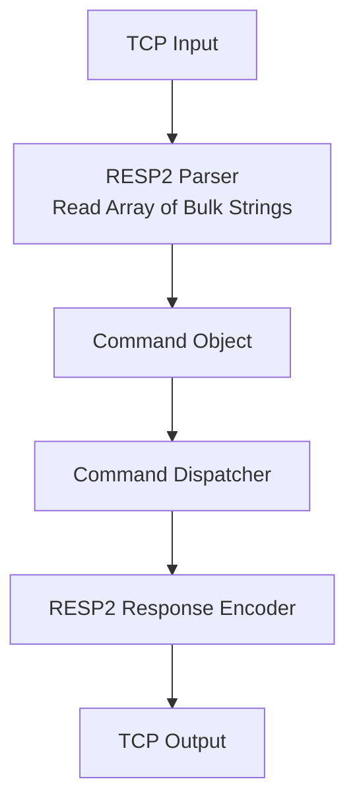

### 10.4 RESP2 编解码示例

**请求**（redis-cli 发送 `SET name ferrum`）：

```text
*3\r\n
$3\r\n
SET\r\n
$4\r\n
name\r\n
$6\r\n
ferrum\r\n
```

**响应**：

```text
+OK\r\n
```

### 10.5 redis-cli 兼容验证

```bash
# Start FerrumKV
./ferrum-kv

# Connect with redis-cli
redis-cli -p 6380
127.0.0.1:6380> SET name ferrum
OK
127.0.0.1:6380> GET name
"ferrum"
127.0.0.1:6380> DEL name
(integer) 1
127.0.0.1:6380> DBSIZE
(integer) 0
```

---

## 11. 异步运行时（Tokio）

### 11.1 实现现状

网络层已于 **v0.4.0** 从 `std::thread` 同步模型迁移到 **Tokio 多线程运行时**。关键的实现点：

- 二进制入口 `main()` 仍是同步 `fn main()`，旧测试套件无需修改。
- `run_listener` 内部通过 `tokio::runtime::Builder::new_multi_thread()` 构造 runtime，支持 `--io-threads N` 显式设置 worker 数。
- `std::net::TcpListener` 被转换为 `tokio::net::TcpListener::from_std`，`accept_loop` 以异步方式消费连接。
- 每条连接一个 `tokio::spawn` 任务，I/O 使用 `AsyncReadExt::read` / `AsyncWriteExt::write_all`。
- `Shutdown` 包装 `Notify + AtomicBool`，accept 循环通过 `tokio::select!` 同时监听 `shutdown.notified()` 和 `listener.accept()`，信号到来后快速退出。
- AOF 写入仍然是同步（`std::sync::Mutex<BufWriter<File>>`），因为持锁窗口短且不跨 await 点，与异步运行时兼容且更易推理正确性。

### 11.2 同步 vs 异步对比

| 维度         | 同步模型（早期 v0.1~v0.3）         | 异步模型（v0.4 开始）                 |
| ------------ | --------------------------------- | ---------------------------------- |
| 并发模型     | one thread per connection         | M:N 协程调度                       |
| 内存开销     | ~8MB/线程（栈空间）               | ~数 KB/任务                         |
| 500 并发     | 受 FD / 栈空间限制，较重          | 已覆盖集成测试                       |
| 上下文切换   | OS 线程切换（重量级）             | 用户态任务切换（轻量级）           |
| 关机感知     | 必须自连接唤醒阻塞 `accept`      | `tokio::select!` 直接优先处理 `shutdown.notified()` |
| 并发基准 | `benches/redis-benchmark.md` v0.3 | `benches/redis-benchmark.md` v0.4  |

### 11.3 运行时架构图

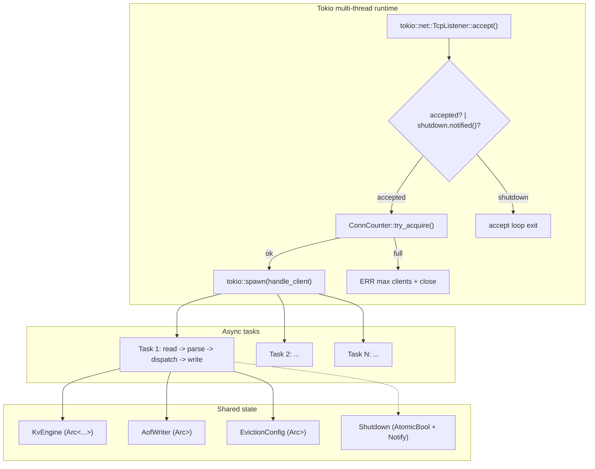

### 11.4 关键代码片段

```rust
// src/network/server.rs (简化)
pub fn run_listener(
    listener: StdTcpListener,
    engine: KvEngine,
    shutdown: Shutdown,
    config: ServerConfig,
) -> Result<(), FerrumError> {
    listener.set_nonblocking(true)?;
    let mut builder = tokio::runtime::Builder::new_multi_thread();
    builder.enable_all().thread_name("ferrum-worker");
    if config.worker_threads > 0 {
        builder.worker_threads(config.worker_threads);
    }
    let runtime = builder.build().map_err(|e| /* ... */)?;
    let result = runtime.block_on(async move {
        let listener = tokio::net::TcpListener::from_std(listener)?;
        accept_loop(listener, engine, shutdown, config).await
    });
    runtime.shutdown_timeout(Duration::from_millis(500));
    result
}

async fn accept_loop(/* ... */) -> Result<(), FerrumError> {
    loop {
        tokio::select! {
            biased;
            _ = shutdown.notified() => break,
            accepted = listener.accept() => { /* spawn handler */ }
        }
    }
    Ok(())
}
```

### 11.5 依赖

| Crate   | 版本   | 特性（`Cargo.toml`）                                               |
| ------- | ------ | ------------------------------------------------------------------ |
| `tokio` | 1.x    | `rt-multi-thread`, `net`, `io-util`, `macros`, `signal`, `sync`, `time` |

---

## 12. 配置管理

### 12.1 配置项

> 📌 配置项名称与 Redis 保持一致，方便始用者用现有 `redis.conf` 翵译。CLI 旗标的全名称在 [cli.rs](/Users/huanyuli/github.com/ferrum-kv/src/cli.rs)，配置文件解析器在 [config/file.rs](/Users/huanyuli/github.com/ferrum-kv/src/config/file.rs)。

| 配置项                      | CLI 旗标                  | 默认值          | 说明                                      |
| ----------------------- | ------------------------- | --------------- | ----------------------------------------- |
| `bind`                  | `--addr HOST:PORT`        | `127.0.0.1:6380` | 监听地址，`bind` + `port` 也能在配置文件中分开写       |
| `port`                  | —                         | `6380`          | 监听端口                                    |
| `timeout`               | `--client-timeout SEC`    | `0` (disabled)  | 客户端空闲超时（秒），`0` 禁用               |
| `maxclients`            | `--maxclients N`          | `10000`         | 并发连接上限，`0` 禁用限制                    |
| `appendonly`            | —（CLI 只能 `--aof-path` 隐式启用） | `no`     | 是否开启 AOF                                |
| `appendfilename`        | `--aof-path PATH`         | `ferrum.aof`    | AOF 文件路径                                |
| `appendfsync`           | `--appendfsync POLICY`    | `everysec`      | `always` / `everysec` / `no`               |
| `loglevel`              | `--loglevel LEVEL`        | `info`          | `off`/`error`/`warn`/`info`/`debug`/`trace`；`FERRUM_LOG` / `RUST_LOG` 优先 |
| `maxmemory`             | `--maxmemory BYTES`       | `0` (unlimited) | 内存上限，支持 `2k` / `100mb` / `1gb` 后缀      |
| `maxmemory-policy`      | `--maxmemory-policy POLICY` | `noeviction` | 见 §9.3，9 种 Redis 风格策略                  |
| `maxmemory-samples`     | `--maxmemory-samples N`   | `5`             | 淘汰采样数（含 AHE）                         |
| `io-threads`            | `--io-threads N`          | `0` (auto)      | Tokio worker 线程数；`0` 让运行时自选择        |

以下之前白皮书提到的参数当前 **未实现**，必要时成为固定常量或留作后续扩展：

| 参数 | 状态 | 说明 |
| ---- | ---- | ---- |
| `ahe_alpha_init` / `ahe_alpha_delta` / `ahe_window_size` | 硕编码 | 见 `AdaptiveHybridState::default()`：step=0.05, window=64 |
| `key_max_bytes` / `value_max_bytes` | 硕编码 | `KEY_MAX_BYTES = 64 KB`，`VALUE_MAX_BYTES = 16 MB` |
| `conn_timeout` | 采用 Redis 同名的 `timeout` | 单位秒

### 12.2 加载优先级

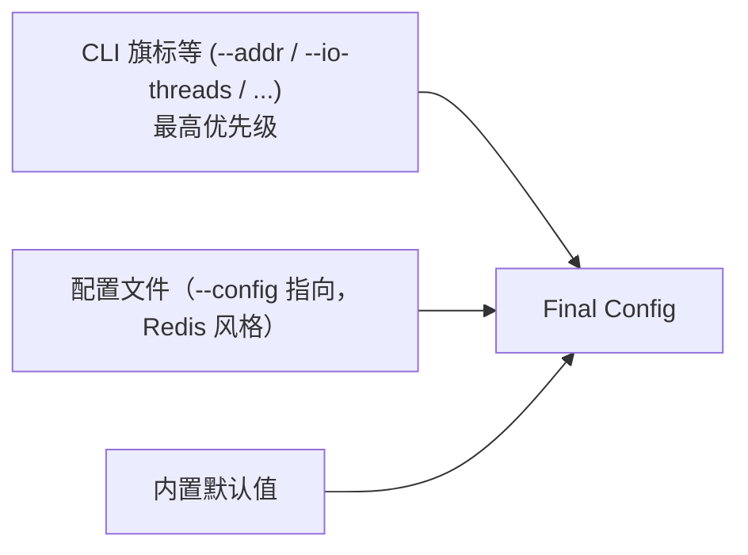

1. **CLI 旗标**（最高优先级）
2. **配置文件**（`--config PATH` 指向，格式完全兼容 `redis.conf`）
3. **内置默认值**

> `FERRUM_LOG` / `RUST_LOG` 环境变量总是能视需覅以上三级优先覆盖日志等级，方便运维临时调高日志。

---

## 13. 并发模型

### 13.1 任务模型

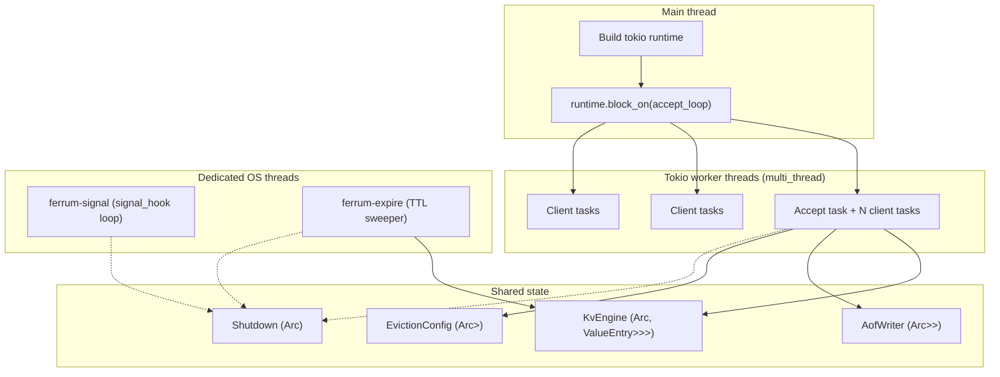

- **Tokio runtime** 承担所有 accept / per-connection I/O。
- **ferrum-signal** 独立 OS 线程阻塞等待 SIGINT/SIGTERM，收到信号后翻转 `Shutdown`。
- **ferrum-expire** 独立 OS 线程的周期采样过期 sweeper，与 Redis `activeExpireCycle` 概念一致（默认 100ms 一轮、每轮采样 20 key）。
- AOF Mutex / KV RwLock 在任务中持锁时窗口尽量短，跨 `.await` 不持锁，避免阻塞整个工作线程。

### 13.2 锁策略

| 操作                                  | 锁类型                      | 说明                                |
| ------------------------------------- | --------------------------- | ----------------------------------- |
| GET / MGET / EXISTS / STRLEN / DBSIZE / TTL / PTTL / MEMORY USAGE | Read Lock    | 允许多读并发；GET 仍会升级为写锁以更新 `last_access` |
| SET / SETNX / MSET / APPEND / INCRBY / DEL / FLUSHDB | Write Lock | 独占写入                              |
| EXPIRE / PEXPIRE / PEXPIREAT / PERSIST | Write Lock                  | 更改 `ValueEntry.expire_at`           |
| 后台 sweeper                           | Write Lock（短窗口）           | 每轮采样后立即释放，避免与客户端任务长时间争锁 |
| AOF 写入                               | `std::sync::Mutex<BufWriter>` | 与 KV 锁解耦，保证写入顺序             |
| 淘汰配置                               | `RwLock<EvictionConfig>`     | `CONFIG GET/SET` 预留的热更新基础    |

---

## 14. 一致性模型

| 类型     | 支持     | 说明                                     |
| -------- | -------- | ---------------------------------------- |
| 强一致   | ❌       | 单机无副本，不涉及分布式一致性           |
| 最终一致 | ✅       | 单机内存操作，写入即可见                 |
| 崩溃恢复 | ⚠️ AOF  | 取决于 fsync 策略，可能丢失最后几条命令  |

---

## 15. 优雅关闭设计

### 15.1 信号处理流程

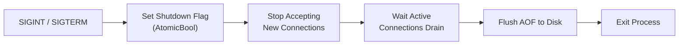

### 15.2 实现要点

- `Shutdown` 封装 `AtomicBool` + `tokio::sync::Notify`，`trigger()` 同时翻转状态位并唤醒所有 waiter。
- `signal_listener` 在独立的 `ferrum-signal` OS 线程上使用 `signal_hook::iterator::Signals` 订阅 `SIGINT` / `SIGTERM`（Unix 下）。
- accept 循环以 `tokio::select! { biased; _ = shutdown.notified() => break, _ = listener.accept() => ... }` 优先处理关机，保证信号一到即停止接新连。
- 空闲连接通过 `client_timeout` 的 `tokio::time::timeout` 回收，TTL sweeper 则在 `shutdown.is_shutdown()` 为真时退出循环。
- 退出前 `drop(AofWriter)` 会调用 `flush()` + `sync_all()`（如配置 `appendfsync != no`）保证所有已确认的写入落盘。

---

## 16. 日志与可观测性

### 16.1 日志级别

| 级别    | 用途                                          | 示例                                    |
| ------- | --------------------------------------------- | --------------------------------------- |
| `ERROR` | 不可恢复错误                                  | IO 失败、锁中毒（PoisonError）          |
| `WARN`  | 可恢复异常                                    | 客户端断连、命令格式错误、AOF 行损坏    |
| `INFO`  | 关键事件                                      | 启动、关闭、AOF 恢复完成、配置加载      |
| `DEBUG` | 调试信息                                      | 命令收发详情、锁获取耗时                |

### 16.2 日志格式

```text
[2026-03-26 12:00:00] [INFO]  FerrumKV listening on 127.0.0.1:6380
[2026-03-26 12:00:01] [INFO]  AOF loaded: 1024 commands replayed in 120ms
[2026-03-26 12:00:02] [INFO]  Client connected: 127.0.0.1:54321
[2026-03-26 12:00:02] [DEBUG] recv: SET name ferrum
[2026-03-26 12:00:02] [DEBUG] resp: OK
[2026-03-26 12:00:05] [WARN]  Parse error from 127.0.0.1:54321: empty command
[2026-03-26 12:01:00] [ERROR] AOF write failed: No space left on device
```

### 16.3 依赖

| Crate        | 用途                                                       |
| ------------ | ---------------------------------------------------------- |
| `log`        | 日志门面（Facade）                                          |
| `env_logger` | 运行时日志输出，支持 `FERRUM_LOG` / `RUST_LOG` 环境变量覆盖  |
| `signal-hook`| 同步信号处理（与 Tokio runtime 解耦的独立线程减少干扰）      |

---

## 17. 安全性考量

| 风险                   | 缓解措施                                        |
| ---------------------- | ----------------------------------------------- |
| 大 Value 导致 OOM      | Value 长度上限 16 MB + `maxmemory` + 9 种淘汰策略      |
| 内存无限增长           | `maxmemory` 配置 + `maxmemory-policy` 自动淘汰       |
| 慢客户端占用 worker    | `timeout` 配置的空闲连接超时 + `tokio::time::timeout` 回收 |
| 恶意大量连接           | `maxclients` 限制（默认 10000）                   |
| AOF 文件损坏           | 启动时逐条校验，预期 `UnexpectedEof` 是最后半条记录→截断并 WARN，其余解析错误跳过并记录 WARN |
| 锁中毒（PoisonError）  | 捕获并返回内部错误，不 panic                    |
| 命令注入               | 严格解析 RESP2 帧，尺寸越界直接终止连接              |

---

## 18. 性能目标与基准

### 18.1 实测基准

当前基准结果跟踪在 [redis-benchmark.md](/Users/huanyuli/github.com/ferrum-kv/benches/redis-benchmark.md)（针对官方 `redis-benchmark` 工具）和 [resp2_bench.rs](/Users/huanyuli/github.com/ferrum-kv/benches/resp2_bench.rs)（基于 Criterion 的 RESP2 解码/编码微基准）。每个发行版本都会追加一组新的 baseline。

### 18.2 主要观察指标

| 维度 | 来源 | 备注 |
| ---- | ---- | ---- |
| 单连接 SET / GET QPS        | `redis-benchmark -q -c 1`            | 用于识别单条路径延迟                      |
| 50 / 500 并发 QPS          | `redis-benchmark -q -c 50/500`       | 衡量 runtime 调度效率                          |
| P50 / P99 延迟             | `redis-benchmark --latency-history`  | 观察带尾可观测性                              |
| Parser 解码吞吐量          | `cargo bench --bench resp2_bench`    | 单独渲染协议性能无网络扰动                 |
| AOF 重放速度               | 启动日志 "AOF loaded: N commands replayed in Xms" | 保证快照化前的启动后格致在可接受区间 |
| 内存占用                 | `INFO memory`、`MEMORY USAGE`         | 验证 `used_memory` 与实际 RSS 偏差在合理范围 |

> 当前包含的版本标签：**v0.1** (同步 socket)、**v0.2** (TTL + LRU)、**v0.3** (LFU + AHE)、**v0.4** (Tokio)。具体数值以 markdown 文档为准，避免在白皮书中硬编码数字。

### 18.3 基准运行示例

```bash
# 一键对 RESP2 启动 redis-benchmark，100 连接，10w 请求
cargo run --release -- --addr 127.0.0.1:6380 &
redis-benchmark -h 127.0.0.1 -p 6380 -c 100 -n 100000 -t set,get,incr,del

# 运行 Criterion 微基准（针对纯解析逻辑）
cargo bench --bench resp2_bench
```

---

## 19. 测试设计

### 19.1 单元测试（`src/**/*.rs` 内嵌 `#[cfg(test)]`）

| 模块       | 测试内容                                      |
| ---------- | --------------------------------------------- |
| `protocol/parser`     | RESP2 帧解析、`NeedMore` 回本、命令映射、负数等边缘       |
| `protocol/encoder`    | Simple / Error / Integer / Bulk / Null / Array 编码           |
| `storage/engine`      | SET/GET/DEL/EXISTS/MGET/STRLEN/APPEND/INCRBY + DBSIZE + INFO |
| `storage/eviction`    | 9 种策略的选择、Morris 概率展开、AHE alpha 观察收敛            |
| `persistence/writer` / `persistence/replay` | RESP2 追加格式、fsync 策略、未完整记录截断 |
| `config/file`         | 默认值、Redis 风格文件解析、内存字面量 `100mb` / `1gb`                 |
| `cli`                 | 旗标与配置文件的优先级合并                                         |

### 19.2 集成测试（[tests/](/Users/huanyuli/github.com/ferrum-kv/tests)）

| 文件 | 覆盖场景 |
| ---- | -------- |
| `kv_engine_test.rs`         | 使用 `std::net::TcpStream` 端到端验证基础命令和错误分支 |
| `resp2_wire_test.rs`        | 针对 RESP2 帧的二进制安全性、管道化、大对象传输、非法帧  |
| `expire_test.rs`            | EXPIRE/PEXPIRE/PERSIST/TTL 语义与意外恢复 |
| `eviction_test.rs`          | 各类淘汰策略在压力下的行为，包含 AHE alpha 漂移 |
| `aof_persistence_test.rs`   | 持久化编码、重放、损坏线容错 |
| `shutdown_test.rs`          | SIGINT/SIGTERM 触发的优雅关闭，确保 AOF flush |
| `client_timeout_test.rs`    | 空闲连接被 `tokio::time::timeout` 回收 |
| `max_clients_test.rs`       | 满连接时的 `ERR max clients reached` 答复 + 日志 |
| `concurrency_stress_test.rs`| 读写混合、500 并发下的正确性与内存统计 |
| `async_concurrency_test.rs` | Tokio 版本下的连接生命周期与等待关闭 |

运行方式：

```bash
cargo test             # 所有单元 + 集成测试
cargo test --test eviction_test
cargo test -- --nocapture --test-threads=1   # 需要确定顺序时
```

### 19.3 异常测试

| 测试场景         | 输入                | 期望输出                                          |
| ---------------- | ------------------- | ------------------------------------------------- |
| 参数不足         | `SET a`             | `ERR wrong number of arguments for 'set' command` |
| 未知命令         | `INVALID_CMD`       | `ERR unknown command 'INVALID_CMD'`               |
| 空请求           | `*0\r\n`           | `ERR unknown command ''`                          |
| 超长 Key         | `SET <64KB+1 B> v`  | `ERR key too long (max 65536 bytes)`              |
| 超长 Value       | `SET k <16MB+1 B>`  | `ERR value too long (max 16777216 bytes)`         |
| Value 含任意字节  | `SET k "ab\r\ncd"`   | `+OK`（RESP2 Bulk String 二进制安全）                  |
| 内存硬塑 + noeviction | `maxmemory` 已满     | `OOM command not allowed when used memory > 'maxmemory'` |

---

## 20. 里程碑

### Phase 1～5：核心骨架与持久化 🔨💾

- [x] TCP Server + 连接处理（v0.1 端着同步模型，v0.4 迁移到 Tokio）
- [x] RESP2 流式解析器 + 编码器（命令表格在 §6.2）
- [x] KvEngine（`Arc<RwLock<HashMap<Vec<u8>, ValueEntry>>>` + 内存统计）
- [x] 错误模块统一（`FerrumError`）与 Response Formatter
- [x] AOF Writer + Replay + `always`/`everysec`/`no` fsync 策略与末尾截断
- [x] 配置系统（Redis 风格的 `redis.conf` 兼容解析 + CLI 覆盖）
- [x] 测试基础设施（单元 + 集成，见 §19.2）

### Phase 6：内存管理与键过期 🧠

- [x] `EXPIRE` / `PEXPIRE` / `PEXPIREAT` / `TTL` / `PTTL` / `PERSIST`
- [x] 惰性过期（读写返回前检查 + 清理）
- [x] 后台采样式 `activeExpireCycle`（`ferrum-expire` 线程）
- [x] `maxmemory` + 9 种策略，含原创 **allkeys-ahe / volatile-ahe**
- [x] Morris 计数器共享 LFU 与 AHE，避免额外字段

### Phase 7：RESP2 统一线协议 📡

- [x] RESP2 流式解析、`KvEngine` key/value 升级到 `Vec<u8>`
- [x] `redis-cli` / `redis-benchmark` 端到端验证

### Phase 8：异步运行时 + 收尾 ⚡

- [x] Tokio multi-thread runtime + `tokio::select!` 优雅关闭
- [x] `--io-threads` 可配置 worker 线程数
- [x] 异步/同步 Benchmark 对比（v0.3 vs v0.4）
- [x] `signal-hook` 独立信号线程（同时兼容 Unix 下的 SIGINT/SIGTERM）

> 当前主线已发布 `v0.4.0`（见 `git tag`）。以下为后续规划项，见 §22 Roadmap。

```mermaid
gantt
    title FerrumKV Development Plan (actual)
    dateFormat  YYYY-MM-DD

    section v0.1 Core
    TCP + Threads        :done, a1, 2026-01-01, 3d
    Parser + Engine      :done, a2, after a1, 4d
    Core commands        :done, a3, after a2, 3d
    AOF + Replay         :done, a4, after a3, 4d

    section v0.2 Memory Mgmt
    TTL + Active expire  :done, b1, after a4, 3d
    maxmemory + LRU      :done, b2, after b1, 3d

    section v0.3 Advanced Eviction
    LFU (Morris)         :done, c1, after b2, 3d
    AHE algorithm        :done, c2, after c1, 4d
    Observability        :done, c3, after c2, 2d

    section v0.4 Async Runtime
    Tokio migration      :done, d1, after c3, 3d
    Signal + Shutdown    :done, d2, after d1, 2d
    Benchmark + Docs     :done, d3, after d2, 2d

    section Future
    RDB snapshot         :e1, after d3, 4d
    CONFIG GET/SET       :e2, after e1, 2d
    Pub/Sub              :e3, after e2, 4d
```

---

## 21. 风险与缓解

| 风险                       | 影响 | 缓解措施                                      |
| -------------------------- | ---- | --------------------------------------------- |
| Rust 异步类型系统学习曲线      | 中   | 分阶段迁移：v0.1～v0.3 同步模型，v0.4 才引入 Tokio。AOF 层仍保留同步锁以降低覆盖 |
| 锁竞争导致性能瓶颈         | 中   | 读写锁分离、锁粒度尽量粒细，后续可考虑分片锁（ShardedLock）   |
| AHE 算法调参复杂度         | 低   | `alpha` 和 `step` 有默认值；`INFO memory` 暴露收敛轨迹            |
| AOF 文件无限增长           | 中   | 规划中的 Compaction（v0.5+），当前提供 `FLUSHDB` + 手动重建之可行路径 |
| Windows 下 SIGTERM 不可用   | 低   | `signal-hook` 在非 Unix 平台缺省禁用重载，可通过 Ctrl+C 触发优雅关闭 |
| RESP2 解析安全性          | 低   | 严格长度上限 + Bulk 长度上限 + 非法字节拒收          |
| AHE 自适应在极低淘汰频率时收敛慢 | 低 | `window_size` 默认 64，写入负载足够时能在少量批次内收敛 |

---

## 22. 未来扩展方向（Roadmap）

```mermaid
flowchart LR
    V1["v0.1<br/>Core KV + AOF"] --> V2["v0.2<br/>TTL + maxmemory + LRU"]
    V2 --> V3["v0.3<br/>LFU + AHE + Observability"]
    V3 --> V4["v0.4<br/>Tokio async runtime"]
    V4 --> V5["v0.5<br/>RDB + AOF rewrite"]
    V5 --> V6["v0.6<br/>Pub/Sub + CONFIG GET/SET"]
    V6 --> V7["v0.7+<br/>Cluster / Replication"]
```

| 版本  | 特性                                                    | 状态     |
| ----- | ------------------------------------------------------- | -------- |
| v0.1  | Core KV Engine + AOF 持久化 + RESP2                    | ✅ 已发布 |
| v0.2  | TTL / EXPIRE / PERSIST + `maxmemory` + LRU 淘汰         | ✅ 已发布 |
| v0.3  | LFU（Morris）+ AHE 原创策略 + `INFO` 可观测性           | ✅ 已发布 |
| v0.4  | Tokio 异步运行时 + 信号处理 + benchmark 对比          | ✅ 已发布 |
| v0.5  | RDB 快照 + AOF rewrite/compaction                      | 📋 规划中 |
| v0.6  | `CONFIG GET/SET` + Pub/Sub + SCAN 渐进式遍历             | 💡 规划中 |
| v0.7+ | 集群（分片 + 副本）、ACL、TLS                          | 💡 规划中 |
---

*FerrumKV — Forged in Rust, Built to Last.* 🦀
