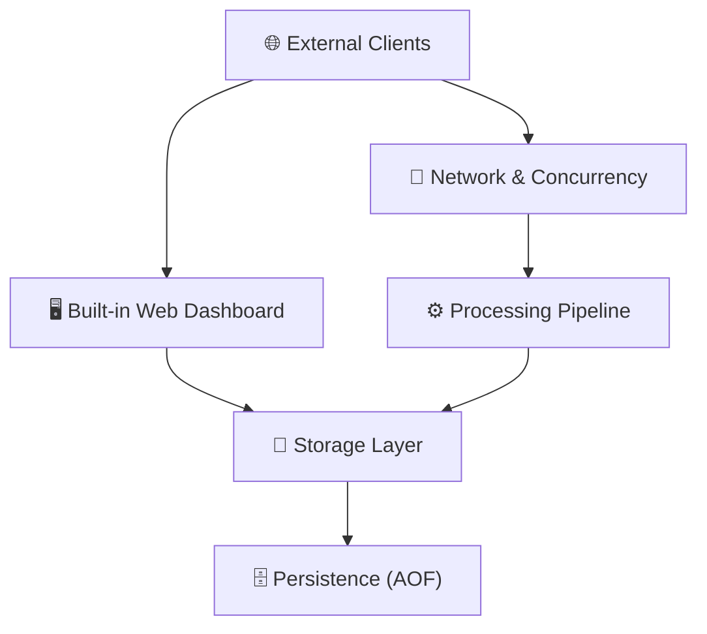

# Architecture

FerrumKV is a single static binary. A Tokio runtime drives both the RESP2
listener and the built-in web dashboard, and the two front-ends share one
`KvEngine` instance — so anything you do in the dashboard is instantly visible
to connected Redis clients.

## Component overview

## Request pipeline

1. **Network** — a `TcpListener` on `:6380` accepts connections; each one is handed to a Tokio task.
2. **Processing** — the RESP2 parser turns the byte stream into a command array, the executor runs it against the `KvEngine`, and the encoder serialises the reply.
3. **Storage** — `KvEngine` owns a `HashMap<Vec<u8>, ValueEntry>` behind an `Arc<RwLock<…>>`. A background sweeper evicts expired keys.
4. **Persistence** — when AOF is enabled, every mutating command is appended (and fsync'd per `--appendfsync`) to `ferrum.aof`; on boot the file is replayed to restore state.
5. **Dashboard** — a separate HTTP listener on `:6381` shares the same engine and renders keys, live stats, and a command console.

## Concurrency model

The server is built on Tokio. RESP connections and the dashboard run as
cooperative tasks on the same runtime, so there is no cross-process state to
keep in sync. The storage layer is guarded by a single `RwLock`, which keeps
the code easy to reason about while still serving many clients concurrently.
