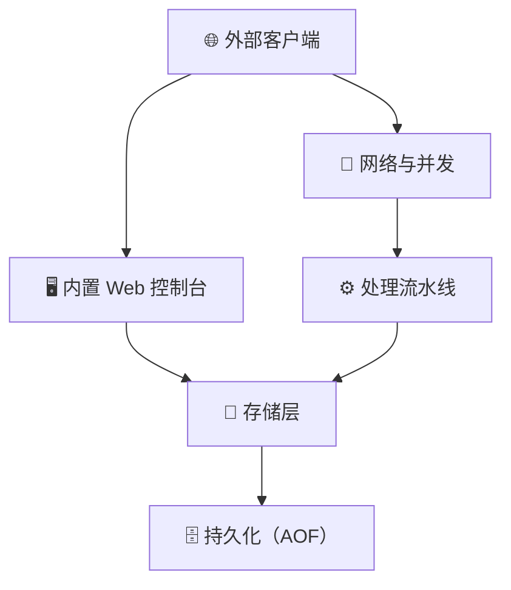

# 架构

FerrumKV 是一个单一的静态二进制文件。Tokio 运行时同时驱动 RESP2 监听器和内置
Web 控制台，两个前端共享同一个 `KvEngine` 实例 —— 因此在控制台中所做的任何修改，
都会立即对连接的 Redis 客户端可见。

## 组件概览

## 请求处理流程

1. **网络** —— `:6380` 上的 `TcpListener` 接受连接，每个连接被交给一个 Tokio 任务处理。
2. **处理** —— RESP2 解析器将字节流转换为命令数组，执行器在 `KvEngine` 上运行命令，编码器将结果序列化返回。
3. **存储** —— `KvEngine` 以 `Arc<RwLock<…>>` 保护一个 `HashMap<Vec<u8>, ValueEntry>`。后台清理线程淘汰过期 key。
4. **持久化** —— 启用 AOF 后，每条写命令都会追加（并依据 `--appendfsync` fsync）到 `ferrum.aof`；启动时回放该文件以恢复状态。
5. **控制台** —— `:6381` 上的独立 HTTP 监听器共享同一引擎，渲染 key、实时指标与命令控制台。

## 并发模型

服务端构建于 Tokio 之上。RESP 连接与控制台作为协作式任务运行在同一个运行时中，
因此不存在需要跨进程同步的状态。存储层由单个 `RwLock` 保护，在保证并发服务大量客户端
的同时，也让代码易于推理。
